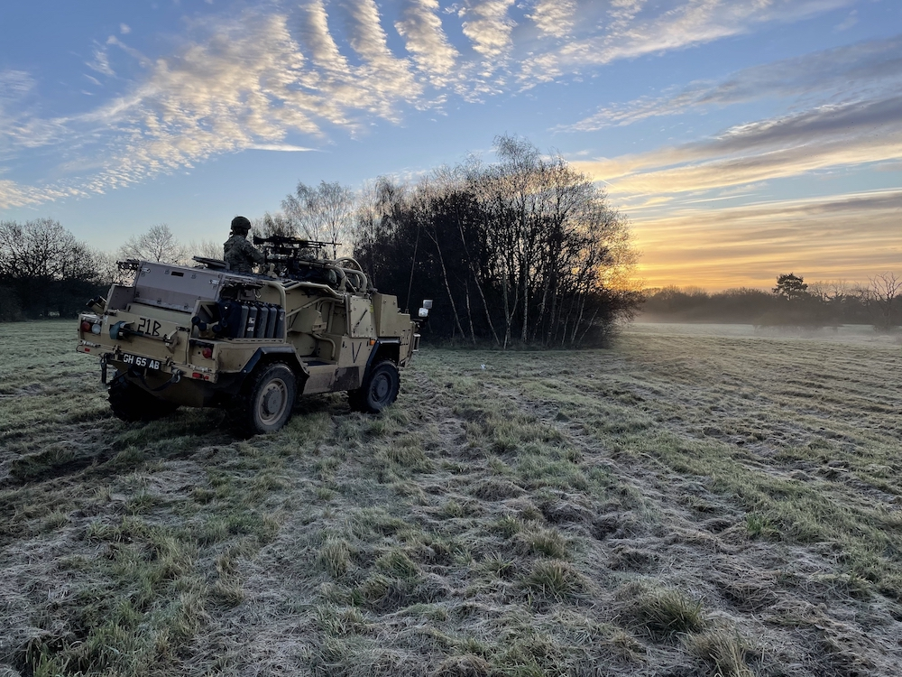
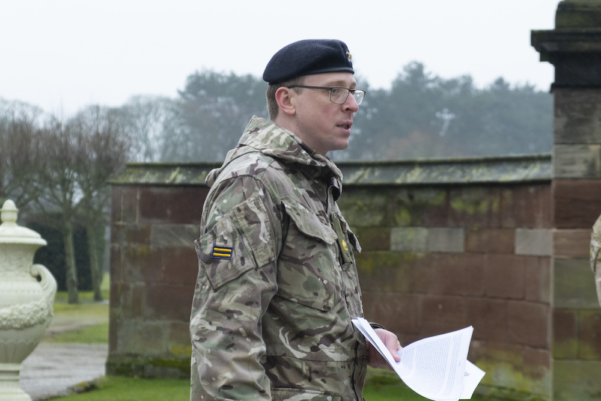
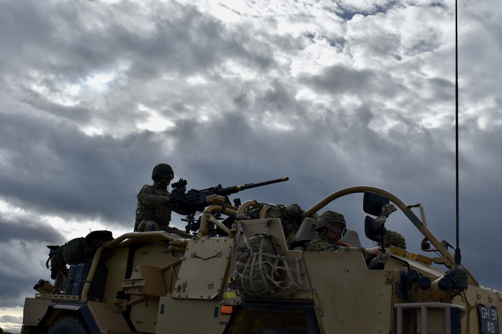

Outside my day job doing compiler research at Shopify, I lead the Cheshire Yeomanry, a squadron of British Army Reserve light cavalry. I spend about a hundred days a year of my spare-time in evenings, weekends, and holidays, training my Squadron.

Most of my friends in the tech community are really surprised and confused about why I’d do this, and what it is I actually do. Some have a very negative reaction. So I thought I’d explain what it practically means to lead the Cheshire Yeomanry, and what it means to me, in terms that might be approachable to people from tech.

## What is the Yeomanry anyway?

In 1797 the Kingdom of Great Britain feared an invasion by the French. You may think of the British as always having a large standing Army, but it was relatively small at the start of the Napoleonic era. To give a better chance of defending the nation against invasion, volunteer units of part-time soldiers were formed to serve only within Great Britain. Infantry were easy to form as they just needed weapons and other basic equipment, but cavalry posed a problem in that it needed trained horses. A way to get these was to borrow them from local farmers and country estates.

A middle-class farmer or servant is a ‘yeoman’ in archaic language, so the units drawn from this class were ‘yeomanry’. As they were coming from country estates it made sense for the estate owners to be appointed officers. In Cheshire, Sir John Leicester was tasked by the King to raise troops of this yeomanry cavalry, using his influence to persuade local estate owners to lend their workers and horses to form troops that they’d command as officers.

Over time, these separate troops became a unified Cheshire Yeomanry. They won the approval of the Prince Regent, the future George IV, so became the Earl of Chester’s Yeomanry - the Earl of Chester is another title for the future King, so today the Earl of Chester, and the Royal Honorary Colonel of the Cheshire Yeomanry’s parent regiment, is Prince Charles.

Napoleon never invaded Great Britain (an Irish-American force did at Fishguards in Wales in 1797, but that’s a different story,) and during the 1800s before the establishment of modern police the Yeomanry were instead used as a gendarmerie to put down domestic unrest instead. The Cheshire Yeomanry were involved in the infamous Peterloo Massacre where cavalry charged into protestors in Manchester.

At the start of the 1900s the Yeomanry became the Imperial Yeomanry so that they could be used abroad for the first time to fight in South Africa, in the Second Boer War.

At the outbreak of the First World War the Cheshire Yeomanry were sent to Norfolk to defend the east coast of England against German invasion. Not a lot of people know that Germany actually bombed England by airship and aeroplane in the First World War. As horse cavalry we were shooting back at them with our machine guns.

One famous Cheshire Yeoman, the 2nd Duke of Westminster, or Bend’Or as he was known, was among the first to take the new idea of armoured cars into war, exercising them against our horses in Norfolk before taking them to France and then conducting a daring raid across the desert in Libya to rescue captured sailors. As the war progressed, the Cheshire Yeomanry went to the middle-east, and fought on horseback in Egypt and Palestine, before ending up like most units on foot in the trenches in France.

At the start of the Second World War we were sent to Palestine, still on horseback. We fought in Palestine, Syria, and Lebanon. People are often amazed to learn that our last fighting on horseback with swords was in 1941, against Vichy France.

In the 1970s with defence cuts the Cheshire Yeomanry went from an independent Regiment to just one sabre squadron of the larger Queen’s Own Yeomanry, which is where we remain today with sister squadrons around the north of England in York, Wigan, and Newcastle. We went through a wide range of tanks and reconnaissance cars. Today we use the Jackal fighting vehicle. It’s a large 4x4, with machine guns mounted in front of the passenger (the commander) and on the top.

What we do today is remarkably similar to what we’ve always done. We fight from armoured cars rather than horses, but we still work ahead of heavier forces, finding the enemy, and striking at targets of opportunity. I still carry a short whip called a crop when in uniform to represent our identity as horse cavalry.

## How did I get into this?

I originally joined the British Army full-time after finishing my masters in computer science at Bristol in 2007. At the time, the campaign in Afghanistan was in full-swing, and the campaign in Iraq was still running. All my peers were going into office jobs in London but I still wanted more fresh air at that point in my life.

After a few years my girlfriend and I married and I left the Army to go back to do a PhD at Manchester. I transferred from the Regular part of the Army to the Reserves, and spent a little free time instructing at an officer training unit attached to the university to complement my stipend.

I left the country to do an internship with the Virtual Machine Group at Oracle in Silicon Valley, which is where TruffleRuby, the project I’m known for, began. My wife and I had a daughter and I had to work a lot to finish my PhD alongside working on TruffleRuby. Living on my own in a foreign country, a PhD, and then a ‘part-time’ job you’re actually working 40 hours on plus a baby are stressful things to combine, so I left the Army for a few years.

After I had graduated and settled down with my daughter and life became calmer, I started to think about what was coming next. For the past decade I’d been switching everything up every few years and I wasn’t ready to stop doing that. By this point I’d been deep in tech for a few years and was feeling the gap in my life.

In 2017, after a year of getting back into shape I decided to take a chance and I asked to join the Cheshire Yeomanry. Since then I’ve been the training officer, the second-in-command, and then just as COVID took hold in early 2020, I was asked to assume command of the Squadron.
What do I actually do?

The Cheshire Yeomanry is a light cavalry squadron of the Queen’s Own Yeomanry of the Royal Armoured Corps of the British Army. The fundamental reason the British Army exists is to fight the Queen’s enemies. The Royal Armoured Corps are the part of the Army that closes with and destroys the enemy through mounted close combat - so fighting an enemy that you can directly see, from vehicles. 

British light cavalry today fight on Jackals, which are large four-wheeled lightly armoured vehicles. They’re lightly armoured so that we can see more and use our weapons more freely. A squadron of light cavalry has three troops of four vehicles each, and a headquarters. Each troop is commanded by an officer and has eleven other soldiers.

I’m the Squadron Leader, so I command the Squadron and I’m ultimately responsible for everything the Squadron does. I make sure that the Squadron is manned, equipped, trained, and ready to fight if we’re asked to. Once a week in the evening I get the Squadron together for training and administration. About one or two weekends a month I take the Squadron out into the countryside for short exercises. And once a year we go on a longer two-week exercise. 

When we’re in the barracks I decide what we need to do and give out tasks. When we’re ‘in the field’ (outside, on exercise) I tactically command the Squadron, taking orders from a battle group or brigade combat team above me and manoeuvring my troops to achieve an effect against the enemy.

People I speak to in tech have some extremely strange ideas about what being in the British Army is like.

First of all, nobody ever shouts ‘sir yes sir’. For the most part people just talk like normal humans. I do keep a distance between myself and the soldiers because they don’t want me to be their friend - they want me to lead them. The soldiers do call me sir or Squadron Leader (just once in a sentence is plenty) and salute me, but the officers are all on simple first-name terms apart from my boss, who I call Colonel.

People also have a mistaken idea that the Army is rigidly hierarchical, and yes it’s always extremely clear who’s in command and we have etiquette, symbols and ceremonies to reinforce this. But the Army and especially the Yeomanry is excellent at integrating everyone’s input and empowering people at all levels. It’s sacrosanct that I tell the people in my Squadron what I want them to achieve, and not how to achieve it. They take this goal from me and then use their own skill and initiative to make it happen. This is ‘mission command’ and violating it and micromanaging my Yeomen is a real taboo. If you try to tell a Yeoman how to cross a piece of ground in their vehicle rather than telling them where to get to they’ll certainly let you know what their job is and what your job is. I feel like tech could really learn something from this.

People think the Army is all about just being told what to do and doing it without question, but really the Army is fastidious about telling people why they’ve been told to achieve something. In our way of delivering orders we emphasise explaining the context two levels up. I may tell my soldiers to raid a compound, but I would also tell them that the reason for this is to create a distraction so that the Colonel can divert the enemy away from a bridge, and that the reason the Brigadier wants the Colonel to divert the enemy is so that the bridge is easier to cross. Not only do the soldiers then know why it’s important to raid the compound (so that others can cross the bridge), but they know that if for some reason they can’t raid the compound, creating any other diversion or distraction will do in a pinch. It lets everyone adapt to change as it happens without additional instruction if they aren’t able to get in touch with me. Again I think tech could possibly learn from that.

## How do I fit this into my spare time?

My Squadron forms a 38th of the British cavalry’s sabre capability, so how can I look after that in my spare time? Well it’s basically all of my spare time, for a start. It’s also a burden beyond the time used. My Squadron uses dangerous vehicles, weapons, ammunition, and explosives, and we use them on difficult terrain, in the dark, when tired and wet and under stress, and the responsibility that the Squadron is safe rests on my shoulders.

I have a full-time captain who works during the week in the Squadron and who stays in touch with me daily to act on my behalf. He has three more full-time soldiers and two civilians who run things daily. I also have a team of other Reservist (part-time) officers and soldiers - a second-in-command, a training officer, my sergeant major (my most senior soldier, with decades of experience) and a whole team of my bright young subbies (young officers) and strong sergeants.

## Why do I do it?

I meet a lot of people in tech who tell me with a straight face that they genuinely think we should unilaterally disband the Army right now, and cannot comprehend why I’d have anything to do with it. At RubyConf 2014 someone in the lunch queue asked what I did before I was in tech and asked me if I enjoyed killing babies when I explained.

I think a country absolutely must be able to fight to defend its people and friends. That seems non-negotiable to me, even if the world was safe, which it clearly isn’t. As you can’t generate fighting capacity or knowledge from nothing, you need a standing Army.

If we can agree that we need an Army, why would I be in it? Well someone has to be, and we need confident people to step up to do it - we can’t all just expect that someone else will do it.

But for my own benefit, the Army and my Squadron Leadership sits right at the top of my hierarchy of needs. My fantastic job with Shopify meets my physiological and safety needs, and the job is rewarding and intellectually stimulating (not many people get to work on their PhD work for so long with a team they’ve built around them and I’m very grateful.) But then what? What are you doing to feel alive and to know that you matter? How do you fit into something enduring and bigger than yourself? The Army challenges me every week, and those challenges better me and make me happier. I know that if I don’t turn up and lead my Squadron then nobody’s going to do that for me.

Being in the Army also grounds me in reality and in my community. The tech world can be a relatively narrow cross-section of society. When I spend time with the Army I interact with the full spectrum of my local community. My squadron has nurses, carpenters, architects, police officers, unemployed people, veterinarians, warehouse workers, tree surgeons, railway engineers, pilots, firefighters. I get to interact with people from a variety of backgrounds, a variety of economic situations, with a variety of outlooks. We’re very male dominated that’s true, but all roles are now open to women, and the Squadron has women in both its most junior and second-most senior positions.

More than just interacting with a cross-section of society, it means building a very high level of trust and depending on each other. When we’re in the field there’s absolutely nowhere to hide, with no privacy and no time-off, and you’ll need to manage to get along. There’s a big taboo of being ‘jack’ and not looking after each other or serving yourself before others.

Being in the Army means being regularly pushed completely outside my comfort zone, both physically and mentally. I love the feeling of going out and getting wet, cold, muddy, tired, being put under pressure to operate my Squadron against an enemy trying to defeat me, and having people demand results from me with extreme time and resource constraints, because when I come back home to a pot of tea, a plate of toast, and some compiler hacking on a Sunday evening I appreciate the comfort of normal life all the more.

A final, big part of it is also about how I can give my young daughter an example of values that are important to me in a way that she can see and understand. Values like hard work, self-discipline, selflessness, confidence, leadership, personal standards, and physical fitness - why they’re important, and how to work on them. In the Army she sees me polishing my boots before I go out, and washing my field kit when I get back covered in mud. She sees me on a parade speaking in front of my Squadron and how I interact with people.

If you’re in tech and in the UK, think about joining the Yeomanry. If you’re in London your closest unit is probably the Westminster Dragoons in Fulham, which are part of the Royal Yeomanry. You can join if you’re a British, Irish, or Commonwealth citizen.
