*These are the notes for a talk I gave at JokerConf 2017, which is why they're
written as if we were talking and going through some slides together.*

<iframe width="720" height="433" src="//www.youtube.com/embed/sFf15TvSXZ0" frameborder="0" allowfullscreen></iframe>

One of the reasons that I'm a programming language researcher is that almost
everyone I meet in the the wider computer technology community uses programming
languages and many of them are interested in how they work. When I was first
introduced to programming as a small child and shown a programming language, the
first thing I wanted to know was how did the language work, and one of the first
things I wanted to do was to implement my own language.

What I'm going to do today in this talk is show you something about how the
programming language you all use, Java, works. What's different is that I'm
going to use a project called Graal that implements Java in Java, so that I can
show you how Java works, using Java.

Graal is just one part of how Java works though - it's a just-in-time compiler.
This is the part of a JVM that converts Java bytecode to native machine code at
runtime, and it's a big part of what makes Java as high performance as it is.
It's also what many people I think would consider to be one of the most complex
and opaque parts of the JVM that they may think is outside what they can
understand, and this talk aims to help change that.

If you know what a JVM is, you know broadly what those two terms mean -
*bytecode* and *machine code* - and you can read everyday Java code then you
will have enough to follow me I hope.

I'm going to talk about why we would want to write a new JVM JIT-compiler in
Java itself, and then I'm going to start showing you it's not as special as you
may think it is, by diving into building it, using it, and starting to show you
how the code is just as understandable as any other application.

I'll talk about just a little bit of the theory but then I'll show you how this
is applied to compile a method all the way from the bytecode to the machine
code. I'll show some more details, and then finally I'll talk about why this is
a good thing to have beyond being interesting to have more of Java implemented
in Java for the sake of it.

I'm going to use screenshots of Eclipse, rather than running it during the
presentation, to avoid the inevitable embarrassments of trying to live code.

## What is a JIT compiler?

I'm sure many of you know what a JIT-compiler is, but I'll just cover the basics
so nobody is sitting there afraid to ask that fundamental question.

When you run the `javac` command, or compile-on-save in your IDE, your Java
program is compiled from Java source code into *JVM bytecode*. This is a binary
representation of your Java program. It's more compact and simpler than the
source code. However a conventional processor in your laptop or server can't
actually execute JVM bytecode.

To run your Java program then the JVM interprets the bytecode. Interpreters are
often a lot slower than native code running on a real processor, so the JVM at
runtime can also run another compiler, this time compiling your bytecode to the
machine code that your processor can actually run.

This compiler is usually a lot more sophisticated than the `javac` compiler,
running complex optimisations to produce high quality machine code.

## Why write a JIT compiler in Java?

The OpenJDK implementation of the JVM contains two conventional JIT-compilers
today. The *client* compiler, also called *C1*, is designed to run more quickly
and produce less optimised code. The *server* compiler, also called *opto*, or
*C2*, is designed to take a little more time to run but to produce better
optimised code.

The idea was that the client compiler was better for desktop applications, where
longer pauses for JIT-compilation are annoying, and the server compiler was
better for long-running server applications which can spend more time on
compilation.

Today they can be combined, so that code is compiled with C1 first and then C2
later if they are still being executed a lot and it looks worth spending the
extra time. This is called tiered compilation.

Let's focus on C2 - that was the server compiler which optimises more.

We can clone OpenJDK from a GitHub mirror, or we can browse it directly on the
website.

    $ git clone https://github.com/dmlloyd/openjdk.git

The code for C2 is located at `openjdk/hotspot/src/share/vm/opto`.

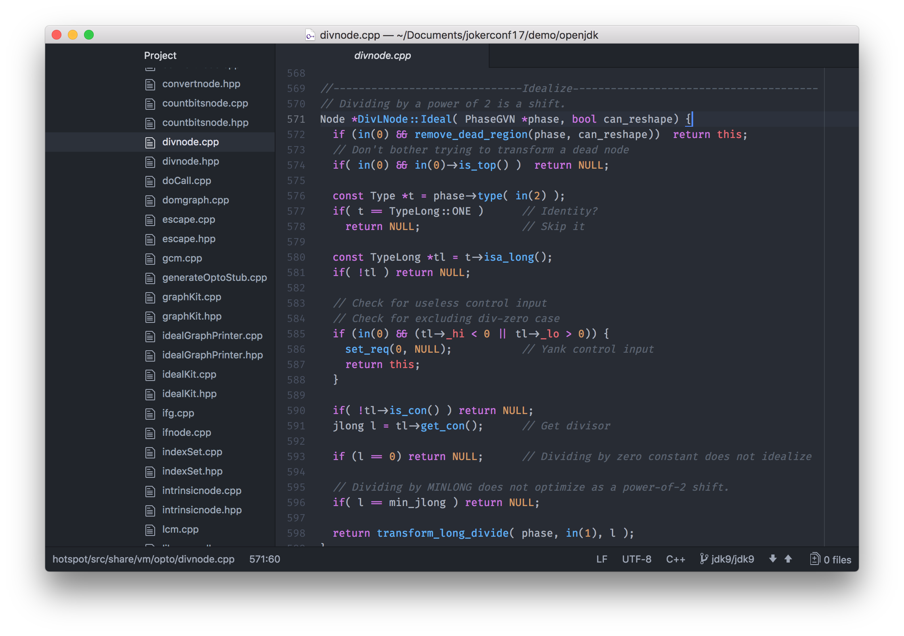

First of all, C2 is written in C++. There's of course nothing inherently wrong
with C++, but it does have issues. C++ is an unsafe language - meaning that
errors in C++ can cause the VM to crash. It's probably also just the age of the
code, but the C++ code in C2 has become very hard to maintain and extend.

One of the key people behind the C2 compiler, Cliff Click, has said that he
would never write a VM in C++ again, and we've just heard that Twitter's JVM
team have said that they think that C2 have become stagnant and is past needing
replacement because development is so difficult.

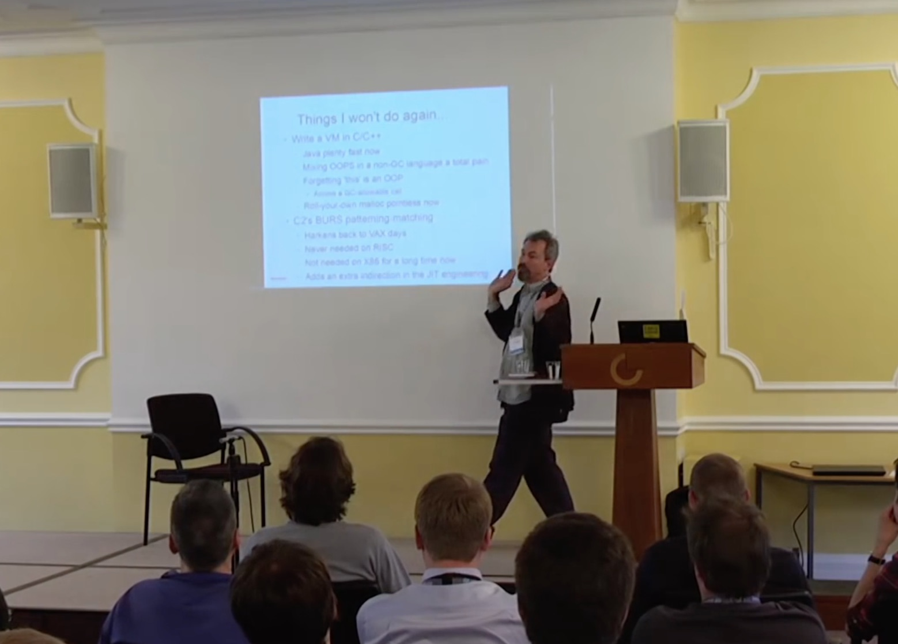

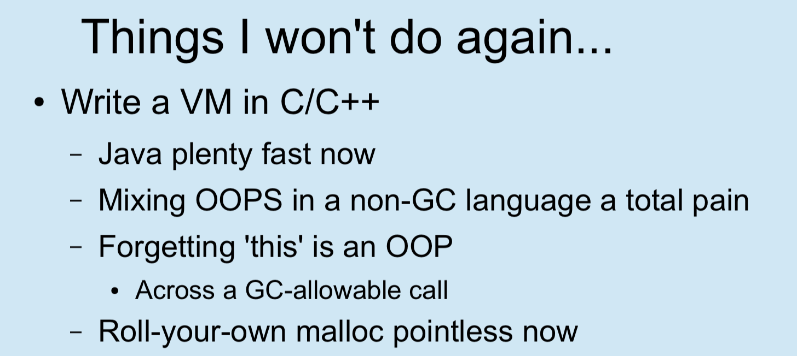

[https://www.youtube.com/watch?v=Hqw57GJSrac](https://www.youtube.com/watch?v=Hqw57GJSrac)

So, going back to the question, what is it about Java that helps solve these
problems? Well, it's all the same things that mean you write your applications
in Java rather than C++. So that's probably safety - exceptions rather than
crashes, no real memory leaks or dangling pointers - good tooling, like being
able to use debuggers, profilers, and tools like VisualVM - good IDE support,
and more.

You may think *but how is it possible to write something like a JIT-compiler in
Java?* You may think that this could only be possible in a low level systems
language like C++, but I hope to convince you in this talk that this isn't true
at all! In fact a JIT-compiler just needs to be able to accept JVM bytecode and
produce machine code - you give it a `byte[]` in and you want a `byte[]` back.
It will do a lot of complex things to work out how to do that, but they don't
involve the actual system at all so they don't need a 'systems' language, for
some definition of systems language that doesn't include Java, like C or C++.

## Setting up Graal

The first thing we need is Java 9. The interface that Graal uses, called JVMCI,
was added to Java as JEP 243 *Java-Level JVM Compiler Interface*, and the first
version to have this was Java 9. I'm using 9+181. There are backports to Java 8
available if people have special requirements.

    $ export JAVA_HOME=`pwd`/jdk9
    $ export PATH=$JAVA_HOME/bin:$PATH
    $ java -version
    java version "9"
    Java(TM) SE Runtime Environment (build 9+181)
    Java HotSpot(TM) 64-Bit Server VM (build 9+181, mixed mode)

The next thing we need is a build tool, called `mx`. This is a bit like Maven or
Gradle, but it's probably not something you'd ever chose for your own
applications. It has some special logic to support some complex use-cases, but
we're just going to use it to do a simple build.

We can clone `mx` from GitHub. I'm using commit `7353064`. Then just add the
executable to our `PATH`.

    $ git clone https://github.com/graalvm/mx.git
    $ cd mx; git checkout 7353064
    $ export PATH=`pwd`/mx:$PATH

Then we want to clone Graal itself. I'm using the version from a distribution
called GraalVM, version 0.28.2.

    $ git clone https://github.com/graalvm/graal.git --branch vm-enterprise-0.28.2


This repository contains some other projects we aren't interested in right now,
so we just want to switch to the `compiler` sub-project, which is the Graal
JIT-compiler itself, and build that using `mx`.

    $ cd graal/compiler
    $ mx build

Now I'm going to use the Eclipse IDE to open the Graal source code. I'm using
Eclipse 4.7.1. `mx` can generate an Eclipse project definition for us.

    $ mx eclipseinit

You will want to open the `graal` directory as workspace, then do *File*,
*Import...*, *General*, *Existing projects* and select the `graal` directory
again. You may then need to attach the JDK sources if you aren't running Eclipse
itself with Java 9.

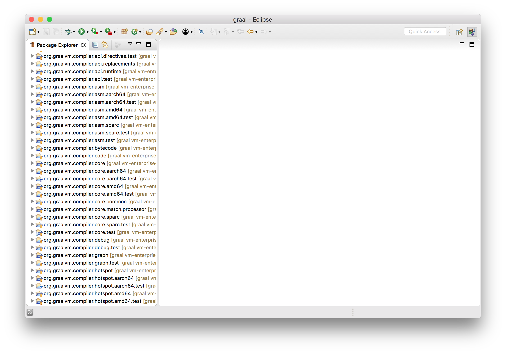

Ok now that we have everything ready, let's show this working. We'll use this
very simple code.

```java
class Demo {
  public static void main(String[] args) {
    while (true) {
      workload(14, 2);
    }
  }

  private static int workload(int a, int b) {
    return a + b;
  }
}
```

We'll compile that with `javac`, and then we'll run the JVM. First of all I'll
show you the conventional C2 JIT-compiler working. To do this I'll turn on a
couple of flags, `-XX:+PrintCompilation` which tells the JVM to log when a
method is compiled, and I'll use `-XX:CompileOnly=Demo::workload` so that only
that method is compiled. If we don't do this the volume of output is a bit
overwhelming and the JVM will be more clever than we want and optimise away the
code we want to look at.

    $ javac Demo.java
    $ java \
      -XX:+PrintCompilation \
      -XX:CompileOnly=Demo::workload \
      Demo
    ...
        113    1       3       Demo::workload (4 bytes)
    ...

I won't explain that beyond saying that is the log entry which shows that the
`workload` method is being compiled.

Now we're going to use the Graal that we just built as our JIT-compiler in our
Java 9 JVM. We need to add some more complicated flags here.

`--module-path=...` and `--upgrade-module-path=...` add Graal to the module
path. Remember that the module path is new in Java 9 as part of the Jigsaw
module system, and you can think of it as being like the classpath for our
purposes here.

We need `-XX:+UnlockExperimentalVMOptions` because JVMCI (the interface that
Graal uses) is just experimental at this stage.

We then use `-XX:+EnableJVMCI` to say that we want to use JVMCI, and
`-XX:+UseJVMCICompiler` to say that we actually want to use it and to install a
new JIT compiler.

We use `-XX:-TieredCompilation` to disable tiered compilation to keep things
simpler and to just have the one JVMCI compiler, rather than using C1 and then
the JVMCI compiler in tiered compilation.

And we still use `-XX:+PrintCompilation` and `-XX:CompileOnly=Demo::workload` as
before.

Just as before, we see that one method being compiled. We've now used the Graal
that we just built to do the compilation though. For the moment you'll just have
to take my word for that.

    $ java \
      --module-path=graal/sdk/mxbuild/modules/org.graalvm.graal_sdk.jar:graal/truffle/mxbuild/modules/com.oracle.truffle.truffle_api.jar \
      --upgrade-module-path=graal/compiler/mxbuild/modules/jdk.internal.vm.compiler.jar \
      -XX:+UnlockExperimentalVMOptions \
      -XX:+EnableJVMCI \
      -XX:+UseJVMCICompiler \
      -XX:-TieredCompilation \
      -XX:+PrintCompilation \
      -XX:CompileOnly=Demo::workload \
      Demo
    ...
        583   25             Demo::workload (4 bytes)
    ...

## The JVM compiler interface

What we've done there is quite extraordinary isn't it? We had a JVM installed,
and we replaced the JIT-compiler in it to a new one that we just compiled
without having to change anything in the JVM. What makes this possible is a new
interface in the JVM called the JVMCI - the JVM compiler interface - this is
what I said was JEP 243 and had gone into Java 9.

The idea is analogous to some other existing JVM technologies.

You may have added custom source code processing to the `javac` compiler in the
past using the Java annotation processing API. This lets you recognise Java
annotations and a model of the Java source code they're attached to and produce
new source files from them.

You may have also added custom Java bytecode processing to the JVM using Java
agents. These allow you to intercept Java bytecode as it's loaded and modify it.

The JVMCI is similar in idea to these. It lets you plug in your own Java
JIT-compiler, written in Java.

At this point I'll say something about the approach I've taken to showing code
in this presentation. I'll show slightly simplified identifiers and logic as
text on the slides to help you understand the idea at first, and then I'll
switch to screenshots of Eclipse to show you the actual code, which may be a bit
more complicated but the big idea will be the same. A big part of this talk is
about showing that you really can dive into the real code, so I don't want to
hide it even if it is a little bit complex.

This is where I want to start dispelling the idea that you may have that a
JIT-compiler is going to be extremely complicated.

What does a JIT-compiler take in as input? It takes the bytecode of the method
it is compiling, and bytecode is, as the name suggests, just an array of bytes.

What does a JIT-compiler produce as output? It produces machine code compiled
from the method. Machine code is also just an array of bytes.

So the interface that you need to implement when you write a new JIT-compiler
and plug it into the JVM will look something like this.

```java
interface JVMCICompiler {
    byte[] compileMethod(byte[] bytecode);
}
```

So if you were thinking how can Java do something as low level as JIT-compile to
machine code, it's not as low level as you thought is it? It's a pure function
from `byte[]` to `byte[]`.

In reality it's actually a little more complex than that. Just the bytecode
isn't quite enough - we also want some information like the number of local
variables, the size of stack needed, and information collected from profiling in
the interpreter so that we know how the code is running in practice. So we'll
say instead that the input is a `CompilationRequest`, which tells us which
`JavaMethod` we want to compile, and say that this can give us all the
information we need.

```java
interface JVMCICompiler {
  void compileMethod(CompilationRequest request);
}

interface CompilationRequest {
    JavaMethod getMethod();
}

interface JavaMethod {
    byte[] getCode();
    int getMaxLocals();
    int getMaxStackSize();
    ProfilingInfo getProfilingInfo();
    ...
}
```

Also, the interface doesn't have you return the compiled machine code - instead
you call another API to tell the JVM that you want to install some machine code.

```java
HotSpot.installCode(targetCode);
```

Now to write a new JIT-compiler for the JVM we just need to implement this
interface. We get the information about the method that we want to compile, and
it's then over to us to compile it to machine code and call `installCode`.

```java
class GraalCompiler implements JVMCICompiler {
  void compileMethod(CompilationRequest request) {
    HotSpot.installCode(...);
  }
}
```

Let's switch to the Eclipse IDE with Graal in it to see what some of these
interfaces and classes look like in practice. As I've said, they'll be a little
more complicated, but not much more.

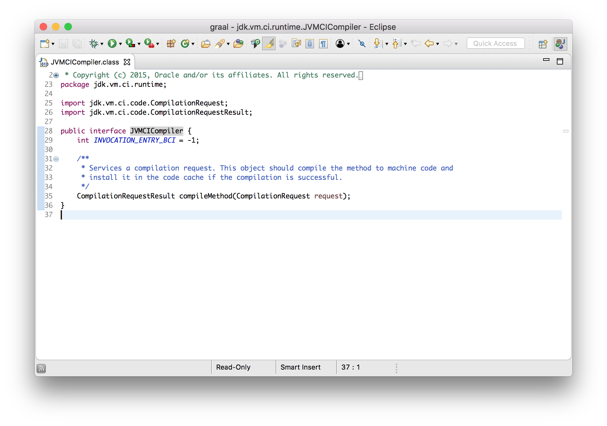

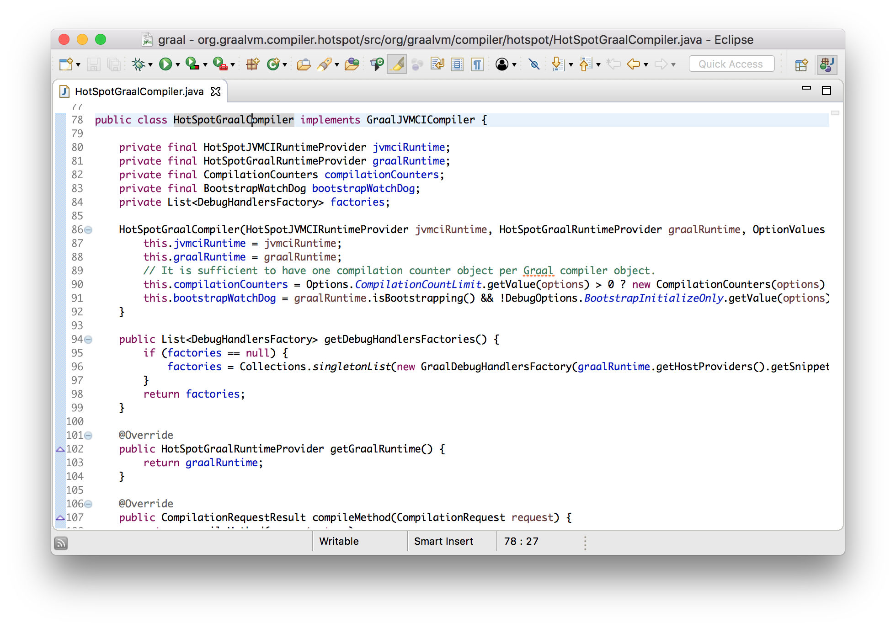

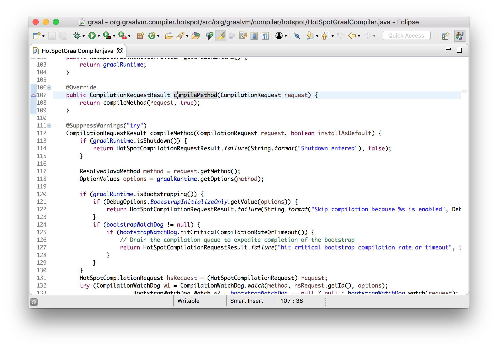

What I want to do now is to show you that we can modify Graal and immediately
use it in Java 9. I'll add my own logging message that just says when Graal is
compiling a method, and I'll add this to the interface method that JVMCI calls.

```java
class HotSpotGraalCompiler implements JVMCICompiler {
  CompilationRequestResult compileMethod(CompilationRequest request) {
    System.err.println("Going to compile " + request.getMethod().getName());
    ...
  }
}
```

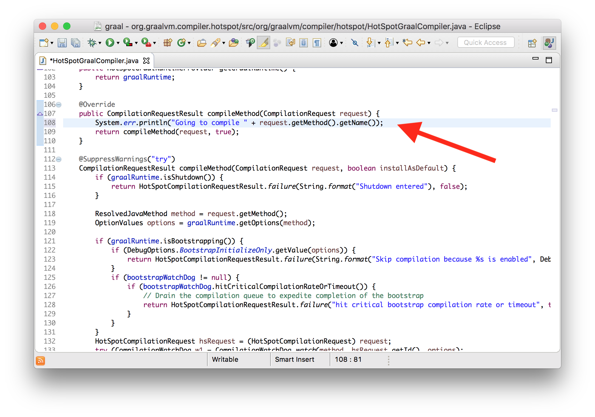

I'm going to turn off the normal HotSpot compilation logging now. We can see our
message printed from our modified version of the compiler.

    $ java \
      --module-path=graal/sdk/mxbuild/modules/org.graalvm.graal_sdk.jar:graal/truffle/mxbuild/modules/com.oracle.truffle.truffle_api.jar \
      --upgrade-module-path=graal/compiler/mxbuild/modules/jdk.internal.vm.compiler.jar \
      -XX:+UnlockExperimentalVMOptions \
      -XX:+EnableJVMCI \
      -XX:+UseJVMCICompiler \
      -XX:-TieredCompilation \
      -XX:CompileOnly=Demo::workload \
      Demo
    Going to compile workload

If you try that edit on your own in Eclipse you'll notice that we don't even
have to run our build system, `mx build`, there. The normal Eclipse compile on
save is enough. And we certainly don't have to recompile the JVM itself. We can
just plug our newly modified compiler into the existing JVM.

## The Graal graph

Ok, so we know that Graal converts one `byte[]` into another `byte[]`. Let's now
talk about a little bit of the theory and data structures that it uses to do
that, because it's a little unusual, even for a compiler.

Fundamentally what a compiler does is to work with and manipulate your program.
To do this it needs to represent your program using some kind of data structure.
Bytecode and similar lists of instructions is one way, but it's not very
expressive.

Instead, Graal uses a graph to represent your program. If you have a simple
addition operator that adds two local variables, the graph is one node to load
each local variables, one node to add them, and two edges to say that the result
of loading the local variables goes into the addition operation.

This is sometimes called a program-dependence-graph.

If we have an expression like `x + y`, we get nodes for the local variables `x`
and `y`, and a node that adds them together.

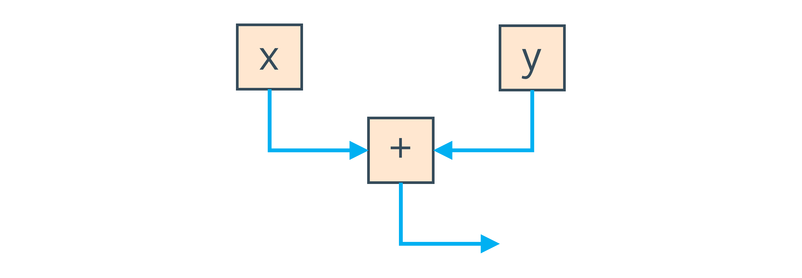

The blue edges in this graph represent how the data flows from reading the local
variables, into doing the add.

We can also use edges to represent the order that the program has to run in. If
we call methods instead of reading local variables, `getX() + getY()`, then we
need to remember which order they were called in and we can't re-order them
(without knowing what code is inside them). To do this we also have an edge
which says do one call and then do the other, and this is shown in red.

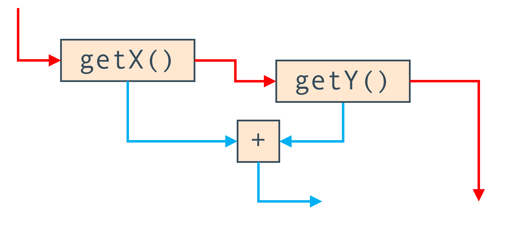

So the Graal graph is in some ways two graphs at once composed on each other.
The nodes are the same, but one set of edges says how the data flows through
them, and the other says how control moves between them.

You can see real Graal graphs by using a tool called the IdealGraphVisualiser,
or IGV. You can start this by running `mx igv`.


Then run the JVM with `-Dgraal.Dump`.

We can see very simple dataflow only by writing a simple expression.

```java
int average(int a, int b) {
  return (a + b) / 2;
}
```

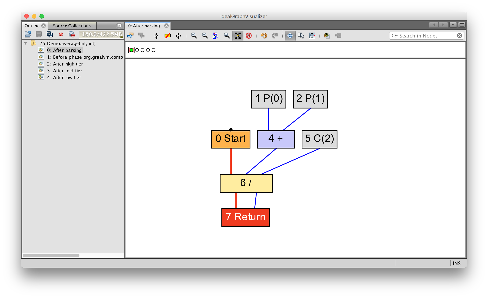

You can see how parameters `0` (written as `P(0)`) and `1` (written as `P(1)`)
feed into an add operation, which feeds into a divide operation with the
constant value `2` (written as `C(2)`). This value is then returned.

We can see more complex data and control flow together if we introduce a loop.

```java
int average(int[] values) {
  int sum = 0;
  for (int n = 0; n < values.length; n++) {
    sum += values[n];
  }
  return sum / values.length;
}
```

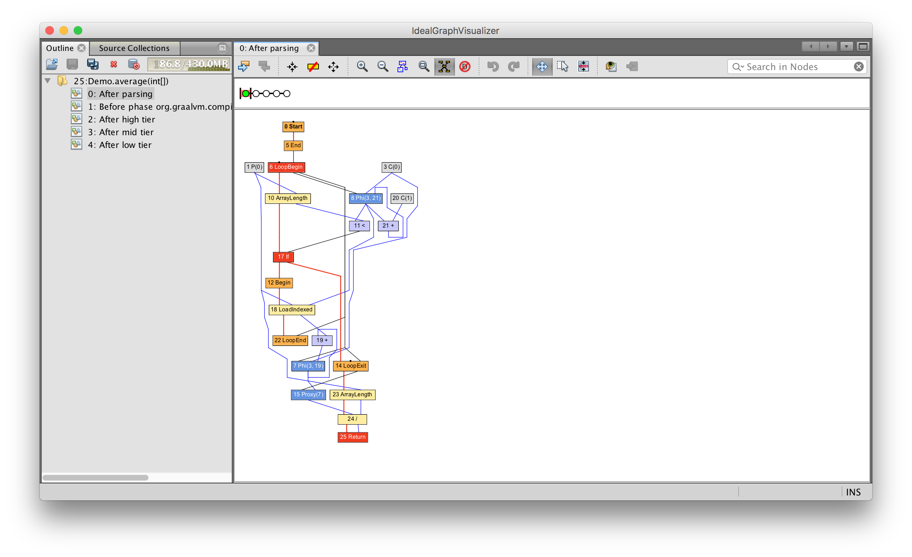

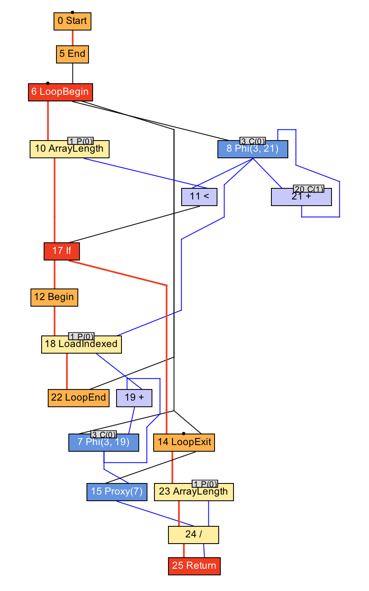

Now we have nodes to begin and end a loop, to read from the array, and to read
the array length. As before, the blue lines show how data flows as before, and
the red lines show how control moves.

You can start to see why this data structure is sometimes called a sea-of-nodes,
or a soup-of-nodes.

I should say that C2 uses a very similar data structure, and it was really C2
that popularised the idea of a sea-of-nodes compiler, so that isn't the
innovation in Graal.

I won't show the process by which this graph is created until the next section
of the talk, but when Graal has your program in this format, it optimises and
compiles it by modifying this data structure. And that's part of why writing JIT
compilers in Java works well; Java is an object-orientated language, and a graph
is a set of objects with references connecting them as edges.

## From bytecode to machine code

Let's see what these ideas look like in practice, and follow along some of the
way through the compilation pipeline.

### Bytecode in

Compilation starts with the bytecode. We'll go back to our tiny addition
example.

```java
int workload(int a, int b) {
  return a + b;
}
```

We'll show the bytecode that we get in by printing it out as the compiler
starts.

```java
class HotSpotGraalCompiler implements JVMCICompiler {
  CompilationRequestResult compileMethod(CompilationRequest request) {
    System.err.println(request.getMethod().getName() + " bytecode: "
      + Arrays.toString(request.getMethod().getCode()));
    ...
  }
}
```

    workload bytecode: [26, 27, 96, -84]

So that's the input to the compiler - the bytecode.

### The bytecode parser and graph builder

This array of bytes is parsed as JVM bytecode into a Graal graph by the graph
builder. This is a kind of abstract interpretation. It interprets the Java
bytecode, but instead of passing around values it passes around loose ends of
edges and connects them up as it goes.

Let's use the advantages of having Graal written in Java and see how this works
using Eclipse's navigation tools. We know our example has an add node in it, so
let's see where those are created.

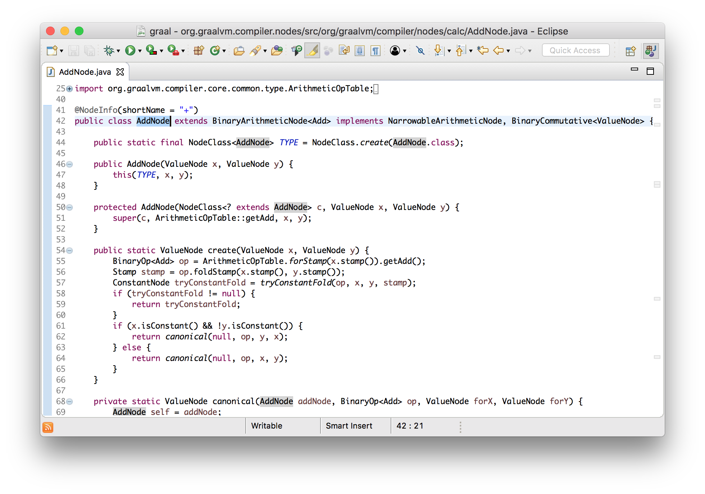

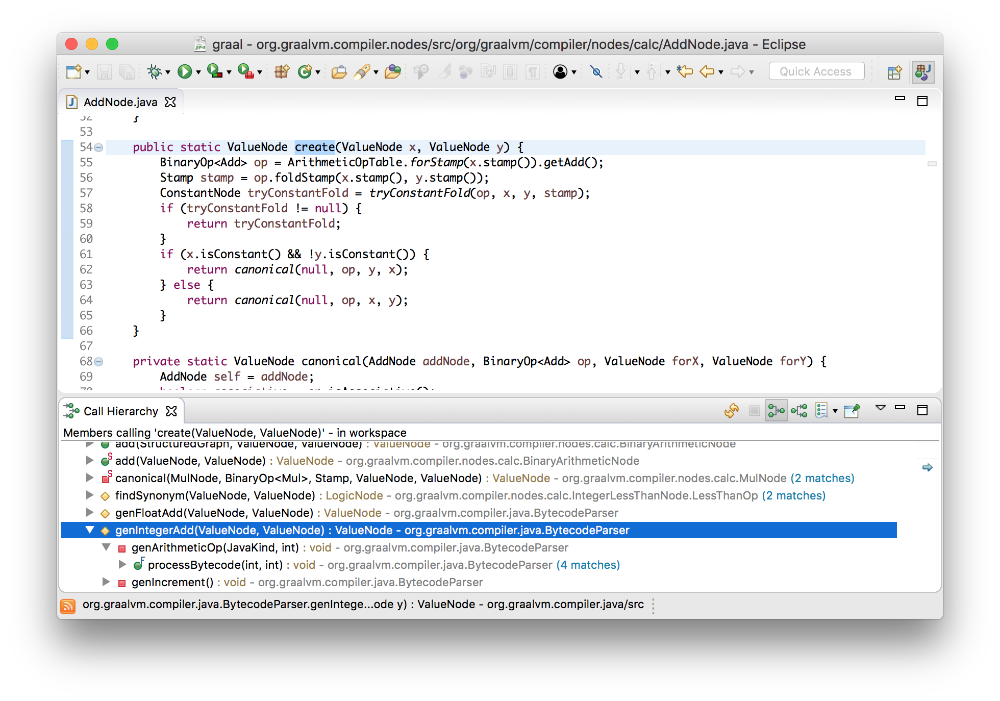

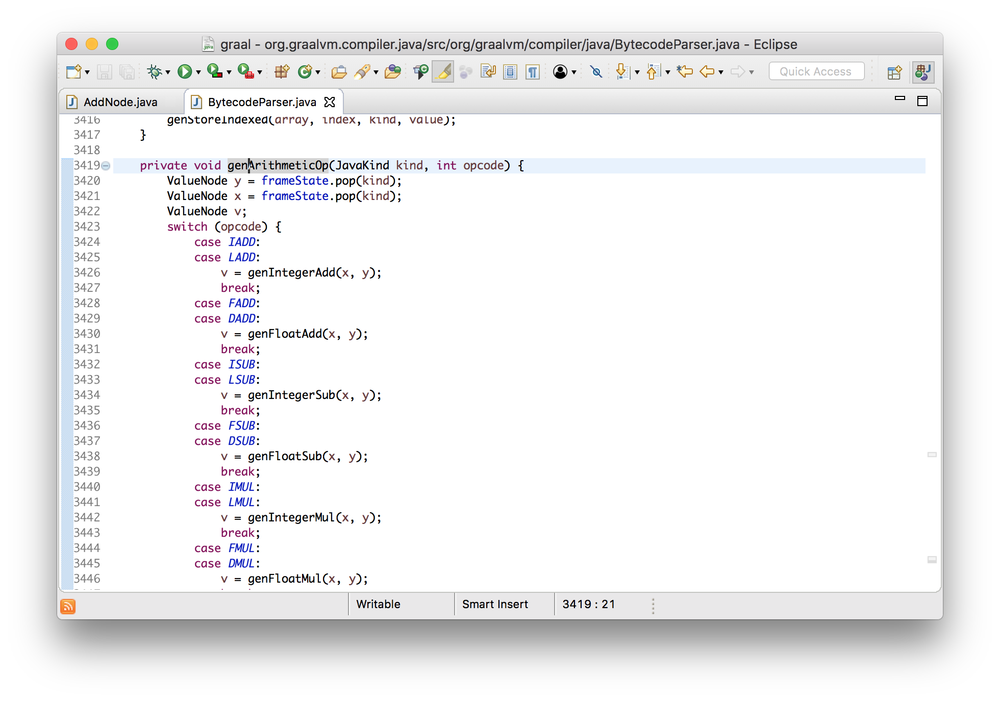

We can see the bytecode parser creating them, and that leads us to the code
where the `IADD` bytecode is parsed. (By the way, `IADD` is bytecode 96, which
we saw in the input bytecode we printed.)

```java
private void genArithmeticOp(JavaKind kind, int opcode) {
    ValueNode y = frameState.pop(kind);
    ValueNode x = frameState.pop(kind);
    ValueNode v;
    switch (opcode) {
        ...
        case LADD:
            v = genIntegerAdd(x, y);
            break;
        ...
    }
    frameState.push(kind, append(v));
}
```

I say that this is abstraction interpretation because this looks a lot like a
bytecode interpreter. If this was an actual JVM interpreter, it would be popping
two values from the stack, doing an addition, and then pushing the result. Here
we pop two nodes from the stack which represent the computation when we actually
run the program, add a new node for the addition, and then push that onto the
stack representing the result of the addition when it is actually run.

This gives us our Graal graph.

### Emitting assembly

When we want to turn the Graal graph into machine code, we need to generate
machine code bytes for each node in the graph. This is done by asking each node
to generate the machine code itself, in a `generate` method.

```java
void generate(Generator gen) {
    gen.emitAdd(a, b);
}
```

Again, we're working at quite a high level of abstraction here. We have a class
that lets us emit the machine code instruction without having to know here the
details of how that works.

Now, the details of `emitAdd` are a bit complicated and abstracted because
arithmetic operators have a lot of different combinations of operands to encode
and the different operators can share most of their code, so I will change
our program to do something a little more simple.

```java
int workload(int a) {
  return a + 1;
}
```

I'll tell you that this will use an increment instruction, and I'll show you
what that looks like in the assembler.

```java
void incl(Register dst) {
    int encode = prefixAndEncode(dst.encoding);
    emitByte(0xFF);
    emitByte(0xC0 | encode);
}

void emitByte(int b) {
    data.put((byte) (b & 0xFF));
}
```

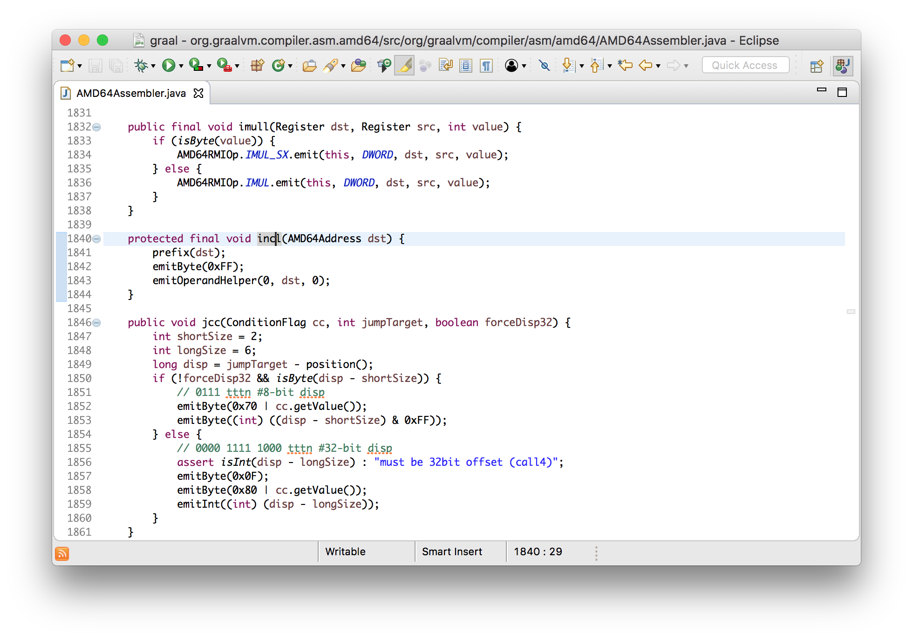

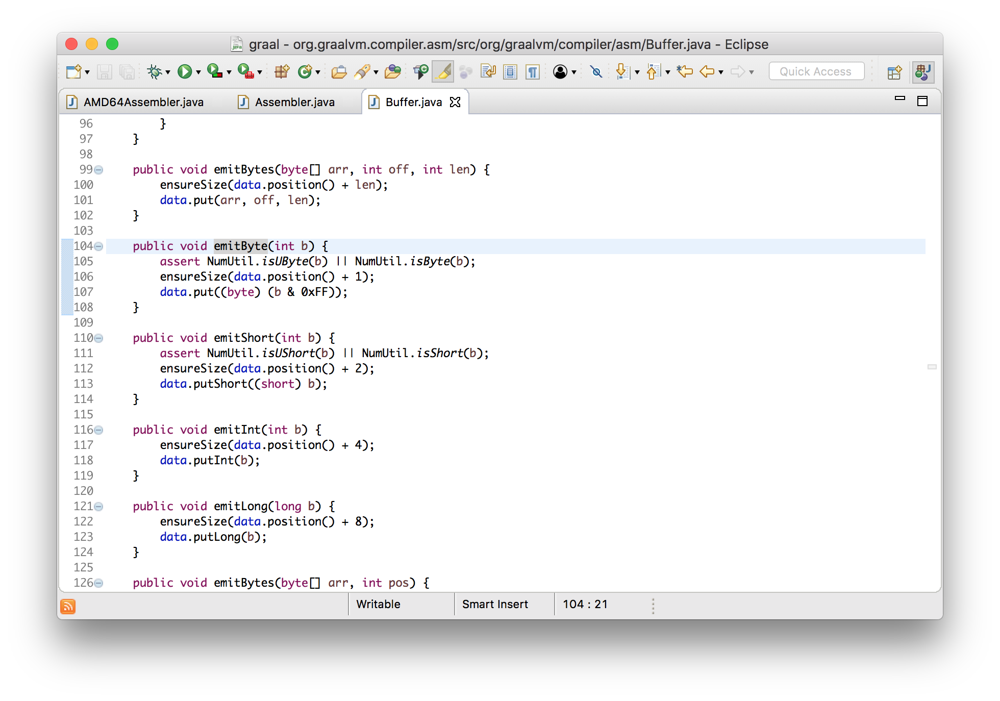

We can see here that it's emitting bytes to the output, and all this does it add
the byte to a standard `ByteBuffer` - it's just building up an array of bytes.

### Assembly out

In the same way as we reviewed the bytecode going in, let's view the machine
code coming out. We'll modify where the machine code is installed to print the
bytes.

```java
class HotSpotGraalCompiler implements JVMCICompiler {
  CompilationResult compileHelper(...) {
    ...
    System.err.println(method.getName() + " machine code: "
      + Arrays.toString(result.getTargetCode()));
    ...
  }
}
```

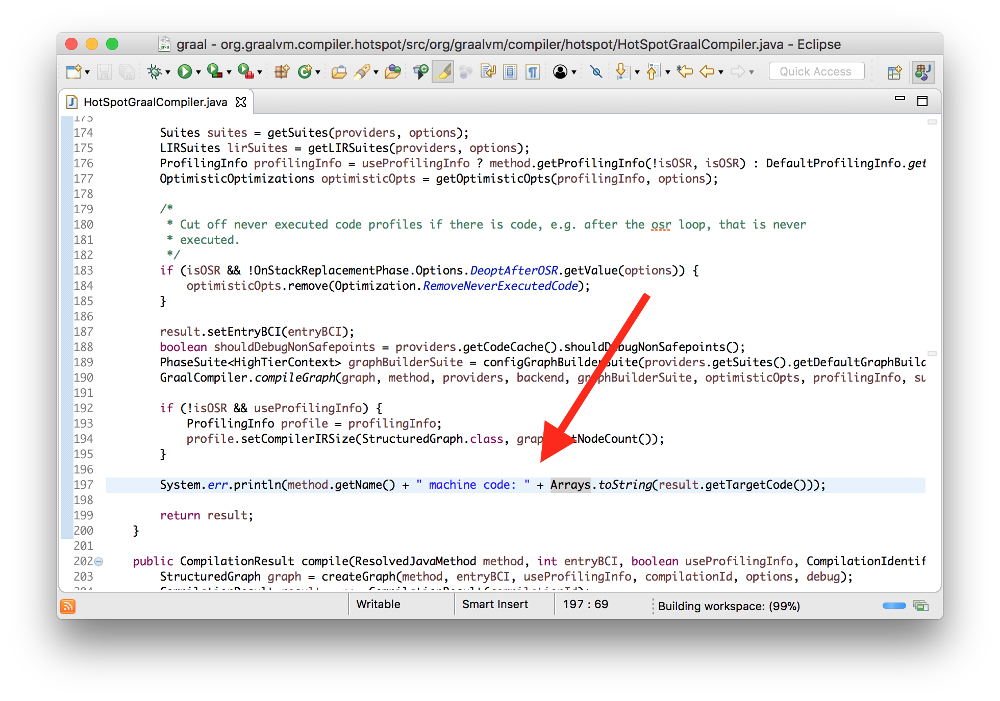

I'll also use a tool that disassembles machine code as it's installed. This is
standard for HotSpot - it's not a Graal thing. I'll show you how to build the
tool - it lives in the OpenJDK repository but it isn't included in the JVM by
default so we have to built it ourselves.

    $ cd openjdk/hotspot/src/share/tools/hsdis
    $ curl -O https://ftp.gnu.org/gnu/binutils/binutils-2.24.tar.gz
    $ tar -xzf binutils-2.24.tar.gz
    $ make BINUTILS=binutils-2.24 ARCH=amd64 CFLAGS=-Wno-error
    $ cp build/macosx-amd64/hsdis-amd64.dylib ../../../../../..

Now I'm going to add two new options, `-XX:+UnlockDiagnosticVMOptions` and
`-XX:+PrintAssembly`.

    $ java \
      --module-path=graal/sdk/mxbuild/modules/org.graalvm.graal_sdk.jar:graal/truffle/mxbuild/modules/com.oracle.truffle.truffle_api.jar \
      --upgrade-module-path=graal/compiler/mxbuild/modules/jdk.internal.vm.compiler.jar \
      -XX:+UnlockExperimentalVMOptions \
      -XX:+EnableJVMCI \
      -XX:+UseJVMCICompiler \
      -XX:-TieredCompilation \
      -XX:+PrintCompilation \
      -XX:+UnlockDiagnosticVMOptions \
      -XX:+PrintAssembly \
      -XX:CompileOnly=Demo::workload \
      Demo

Now we can run our example and see our add instruction being emitted.

    workload machine code: [15, 31, 68, 0, 0, 3, -14, -117, -58, -123, 5, ...]
    ...
    0x000000010f71cda0: nopl   0x0(%rax,%rax,1)
    0x000000010f71cda5: add    %edx,%esi          ;*iadd {reexecute=0 rethrow=0 return_oop=0}
                                                  ; - Demo::workload@2 (line 10)

    0x000000010f71cda7: mov    %esi,%eax          ;*ireturn {reexecute=0 rethrow=0 return_oop=0}
                                                  ; - Demo::workload@3 (line 10)

    0x000000010f71cda9: test   %eax,-0xcba8da9(%rip)        # 0x0000000102b74006
                                                  ;   {poll_return}
    0x000000010f71cdaf: vzeroupper
    0x000000010f71cdb2: retq   

Ok, let's verify that we really are controlling all of this. Let's change the
implementation of addition to make it actually subtraction instead. I'm going to
edit the `generate` method of the addition node to emit a subtraction
instruction instead of an addition instruction.

```java
class AddNode {
  void generate(...) {
    ... gen.emitSub(op1, op2, false) ...  // changed from emitAdd
  }
}
```

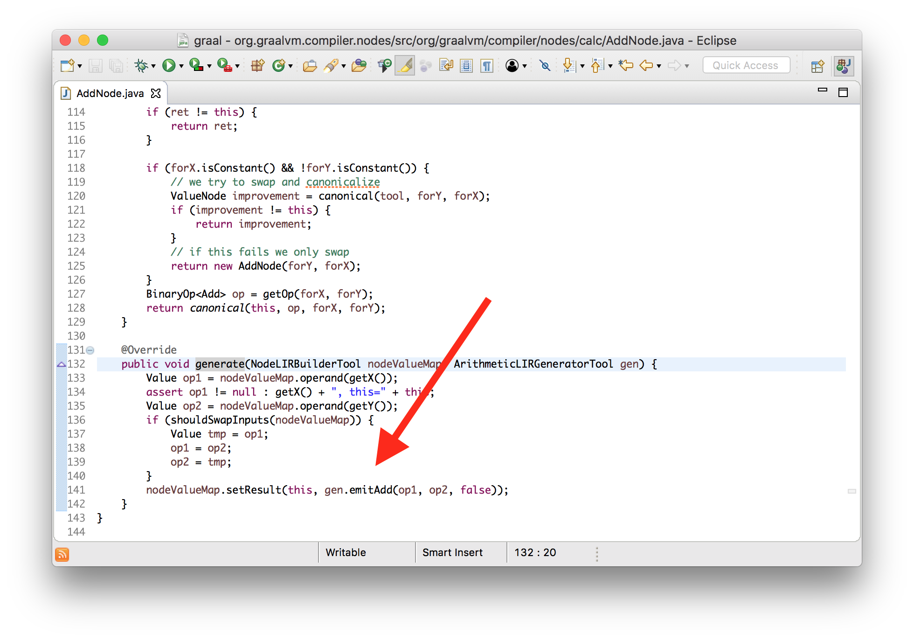

If we run this we can see both the machine code bytes change and the see the new
instruction.

    workload mechine code: [15, 31, 68, 0, 0, 43, -14, -117, -58, -123, 5, ...]
    0x0000000107f451a0: nopl   0x0(%rax,%rax,1)
    0x0000000107f451a5: sub    %edx,%esi          ;*iadd {reexecute=0 rethrow=0 return_oop=0}
                                                  ; - Demo::workload@2 (line 10)

    0x0000000107f451a7: mov    %esi,%eax          ;*ireturn {reexecute=0 rethrow=0 return_oop=0}
                                                  ; - Demo::workload@3 (line 10)

    0x0000000107f451a9: test   %eax,-0x1db81a9(%rip)        # 0x000000010618d006
                                                  ;   {poll_return}
    0x0000000107f451af: vzeroupper
    0x0000000107f451b2: retq   

So what have we learned here? Graal really does take in a simple byte array of
bytecode, we can see how the graph nodes are created from that, we can see how
the nodes emit instructions, and how the instructions are encoded. We saw that
we could change how Graal worked.

`[26, 27, 96, -84]` → `[15, 31, 68, 0, 0, 43, -14, -117, -58, -123, 5, ...]`

## Optimisations

Ok, we've shown how we get the graph, and how the nodes in the graph are output
as machine code. Let's talk now about how Graal optimises the graph to make it
more efficient.

An optimisation phase is just a method that has the opportunity to modify the
graph. You write phases by implementing an interface.

```java
interface Phase {
  void run(Graph graph);
}
```

### Canonicalisation

Canonicalisation means rearranging nodes into a uniform representation. This has
some other purposes as well, but for the purposes of this presentation I'll say
that it really means constant folding and simplifying the nodes.

Nodes are responsible for simplifying themselves - they have a method
`canonical`.

```java
interface Node {
  Node canonical();
}
```

Let's look at something like the negate node, which is the unary subtraction
operator. The negate node will remove itself and its child if it's being applied
to another negate node, leaving just the value behind. It simplifies `--x` to
just `x`.

```java
class NegateNode implements Node {
  Node canonical() {
    if (value instanceof NegateNode) {
      return ((NegateNode) value).getValue();
    } else {
      return this;
    }
  }
}
```

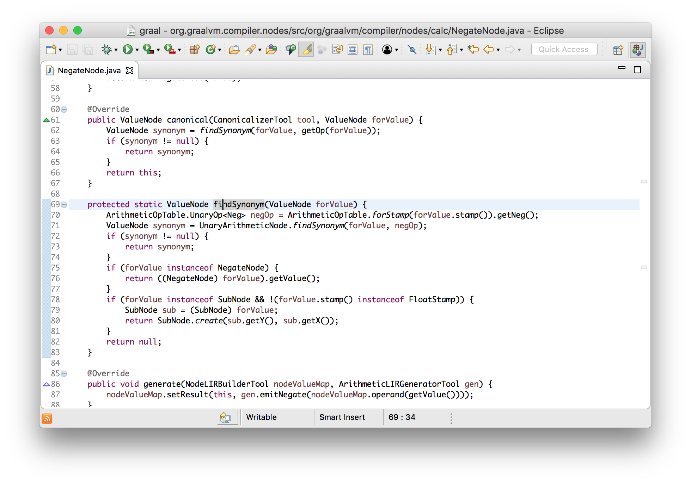

This is a really great example of how understandable Graal is. The logic here is
almost as simple as it could be.

If you have a clever idea for how to simplify a Java operation, you can modify
the `canonical` method to do it.

### Global value numbering

Global value numbering is a technique to remove code that is redundant because
it appears more than once. In this example, `a + b` could be calculated just
once and the value then used twice.

```java
int workload(int a, int b) {
  return (a + b) * (a + b);
}
```

Graal can compare nodes to see if they're equal. It's simple - they're equal if
they have the same inputs. Graal's global value numbering phase looks to see if
each node is equal to any other and replaces them with a single copy if they
are. It does this efficiently by putting all the nodes into a hash map. It's a
bit like a cache of nodes.

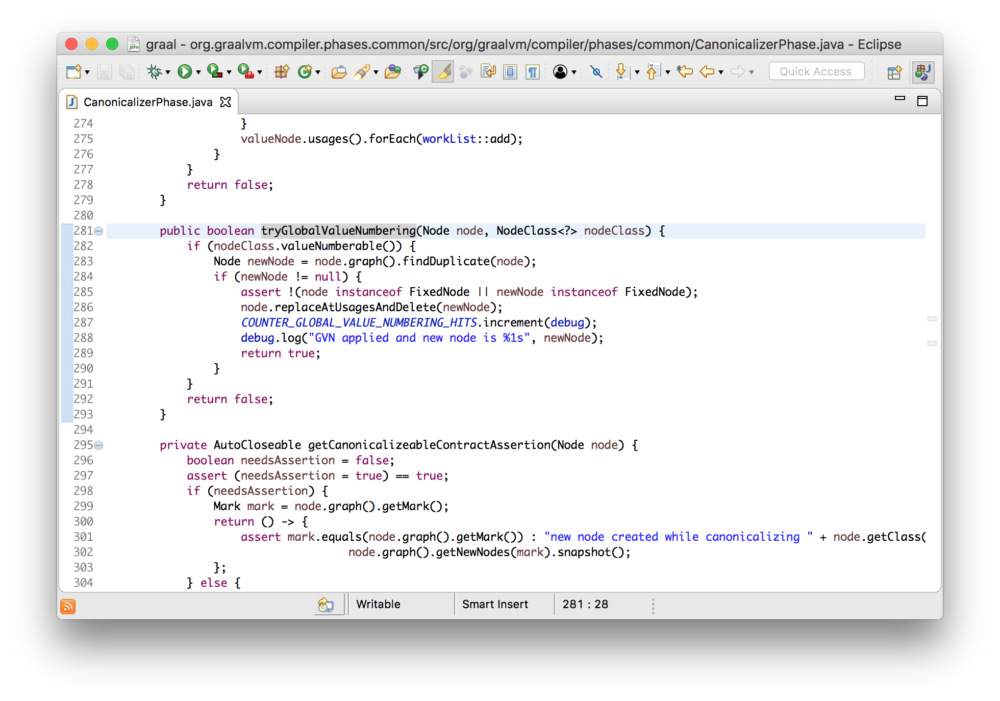

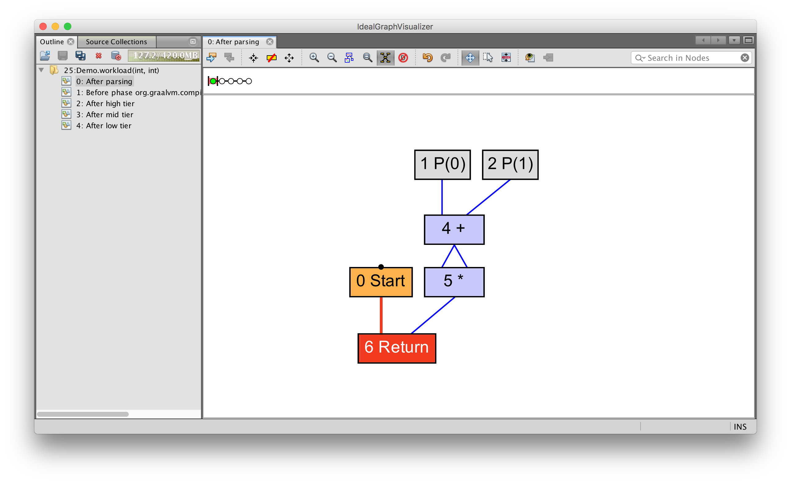

Note that test that the node isn't fixed - this means that the node doesn't
possibly have a side effect so has to happen at a certain point of time. If we
use a method call instead then the terms become fixed and not redundant so they
aren't merged into one.

```java
int workload() {
  return (getA() + getB()) * (getA() + getB());
}
```

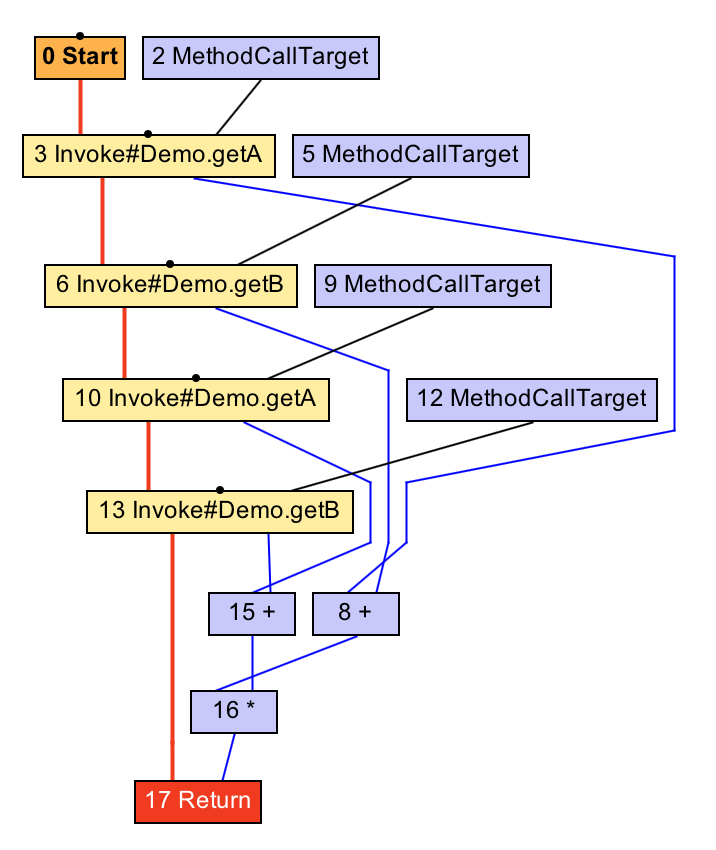

### Lock coarsening

Let's look at one more complex example. Sometimes people write code that
synchronises on the same monitor twice immediately after each other. They may
not literally write this, but it may result from other optimisations such as
inlining.

```java
void workload() {
  synchronized (monitor) {
    counter++;
  }
  synchronized (monitor) {
    counter++;
  }
}
```

We'll de-sugar that and say that it's effectively doing this.

```java
void workload() {
  monitor.enter();
  counter++;
  monitor.exit();
  monitor.enter();
  counter++;
  monitor.exit();
}
```

We could optimise this code to enter the monitor just once, instead of leaving
it just to enter it again. This is lock coarsening.

```java
void workload() {
  monitor.enter();
  counter++;
  counter++;
  monitor.exit();
}
```

In Graal this is implemented in a phase called `LockEliminationPhase`. Its `run`
method looks for all monitor exit nodes and sees if they are immediately
followed by another enter node. It then confirms that they use the same monitor,
and if so will remove them both, leaving the outer enter and exit nodes.

```java
void run(StructuredGraph graph) {
  for (monitorExitNode monitorExitNode : graph.getNodes(MonitorExitNode.class)) {
    FixedNode next = monitorExitNode.next();
    if (next instanceof monitorEnterNode) {
      AccessmonitorNode monitorEnterNode = (AccessmonitorNode) next;
      if (monitorEnterNode.object() == monitorExitNode.object()) {
        monitorExitNode.remove();
        monitorEnterNode.remove();
      }
    }
  }
}
```

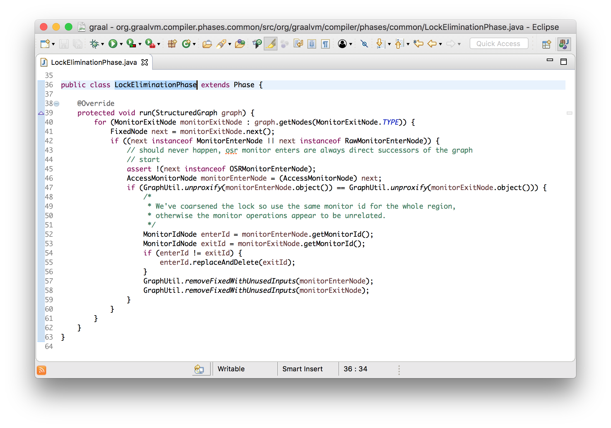

The reason that this is worth doing is that it means less code for the extra
exit and enter, but it also allows us to apply more optimisations such as
combining the two increments into a single add of `2`.

```java
void workload() {
  monitor.enter();
  counter += 2;
  monitor.exit();
}
```

Let's see this working with IGV. We can see the graph go from having the two
pairs of monitor enters and exits, to just one pair, after the optimisation
phase has run, and how the two increments become one addition of the number two.

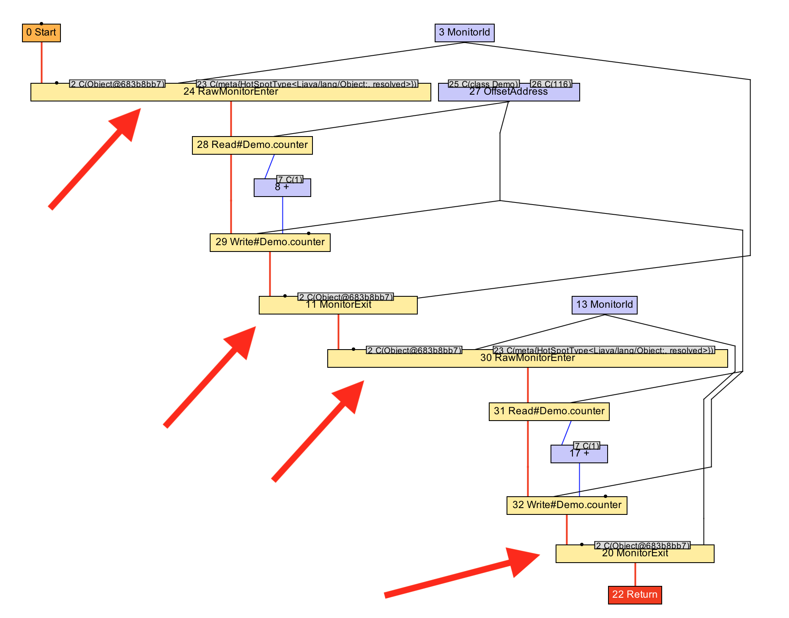

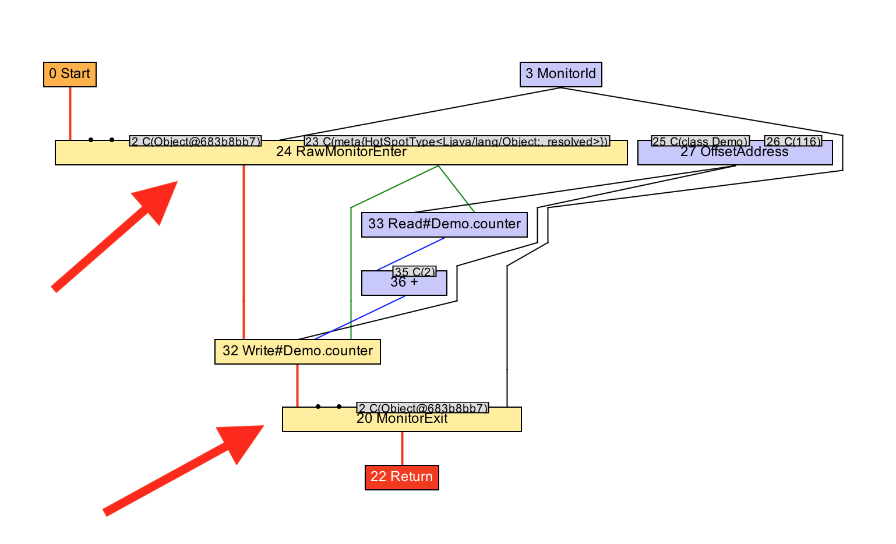

## Some practicalities that I haven't talked about

In giving a high-level overview of how Graal works of course I'm skipping over a
lot of important practical details for making it work well and making the code
it produces efficient, and I'm actually also skipping some essential things that
are needed to make it work at all.

I haven't talked about some of these parts of Graal because they aren't as
simple conceptually to show like the code I've gone through already, but I'll
still point you at where you can find them if you want.

### Register allocation

In the model of the Graal graph we have nodes passing values to each over their
edges. But what are these edges in practice? If a machine instruction needs data
to be passed in or passed out what does it use?

The edges are eventually mapped to the processor's registers. Registers are like
the processor's hardware local variables. They're the highest part of the
system's memory hierarchy, above the various levels of processor cache, which
are in turn above the system RAM. Machine instructions can read or write
registers, and value can so be passed from one instruction to another by being
written into a register by the first, and then read from a register by the
second.

Deciding which registers to use for each edge is a problem called *register
allocation*. Graal uses similar register allocation algorithms to other
JIT-compilers (it's the *linear scan* algorithm).

### Scheduling

The other essential problem I haven't mentioned is that we have a graph of nodes
without any clear order to run them in, but the processor needs a linear
sequence of instructions in a definite order.

For example an add instruction could take two values as input to add together,
and if there isn't a need to execute one before the other - if they don't have
any side effects - then the graph doesn't tell us which to execute first. When
we emit machine code though we do need to make a decision and put one of the
inputs's code before the other.

This problem is called graph scheduling. The scheduler needs to decide what
order to run all the nodes in. It decides when to run code based on the
constraints that all values need to have been computed by the time that they're
needed for a computation. You could produce a schedule which just works, but you
can improve the performance of code for example by not running a computation
until the value is definitely needed.

You can get even more sophisticated by applying your understanding of what
resources your processor has and giving it work in an order which means those
resources are used as efficiently as possible.

## What can you use Graal for?

I said at the start of the presentation in the legal slide that Graal is just a
research project at the moment, rather than an Oracle product that we are
supporting. What do we anticipate could be the applications of the research that
is going into Graal?

### A final-tier compiler

Graal could be used as a final-tier in HotSpot, via JVMCI, which is what I've
been showing in my demos. As we develop new optimisations in Graal that HotSpot
doesn't currently have, Graal could be the compiler that you use in order to get
better performance.

Twitter have talked about how they're using Graal for this purpose, and with the
release of Java 9 this is something practical that you can do today if you want
to start experimenting. You just need `-XX:+UseJVMCICompiler` and the other
flags to get started.

The great thing about JVMCI is that it lets you ship Graal separately from the
JVM. You can deploy one version of the JVM, and then deploy new versions of
Graal separately. In the same way that you don't need to recompile the JVM to
use a Java agent, you don't have to recompile the JVM to update the compiler if
you are using Graal.

*Metropolis* is an OpenJDK project to implement more of the JVM using the Java
programming language. Graal could be one step towards doing this.

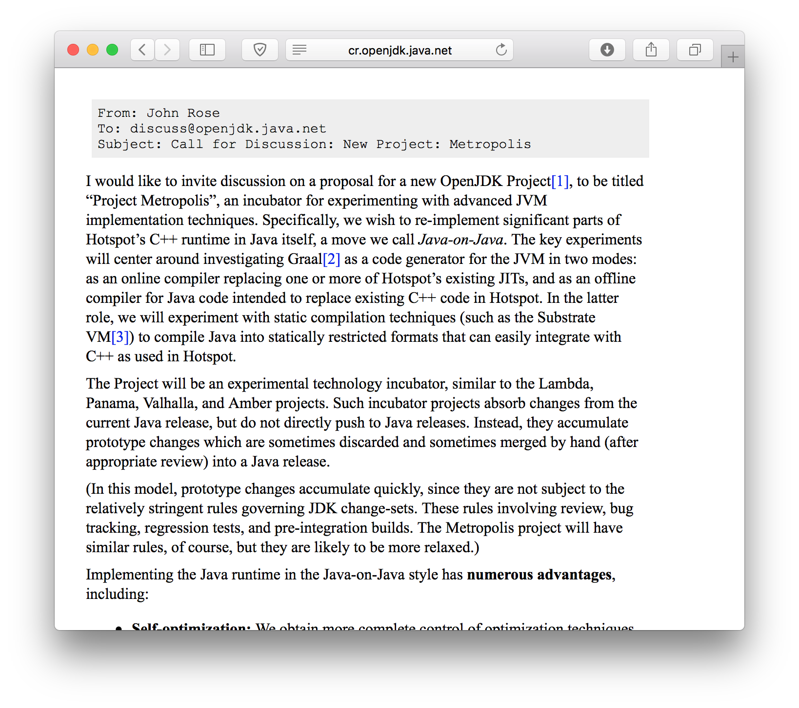

[http://cr.openjdk.java.net/~jrose/metropolis/Metropolis-Proposal.html](http://cr.openjdk.java.net/~jrose/metropolis/Metropolis-Proposal.html)

### Your own specific optimisations

It's also possible to extend Graal with extra optimisations. In the same way
that you can plug Graal into the JVM, you can plug new compilation phases into
Graal. If you knew that you wanted to apply a specific optimisation to your
application you could write a Graal phase to do that. Or if you had some
specific set of machine code instructions that you wanted to run you could write
a new intrinsic method rather than having to write a native method and call it
via JNI.

Charles Nutter has already been proposing doing this for JRuby and has
demonstrated it having a positive performance impact when he added a new phase
to Graal to relax object identity for Ruby's boxed numbers. I'm sure he'll be
doing some conference talks about this soon.

### Ahead-of-time compilation

Graal is just a Java library. JVMCI provides interfaces that Graal can use to do
lower-level things such as installing machine code, but most of Graal is
pretty-well isolated from them. That means you can use Graal for other
applications beyond being a JIT-compiler.

There isn't really much difference between a JIT-compiler and a more
conventional ahead-of-time compiler, and Graal can be used to build one of those
as well. There are actually two projects doing this.

Java 9 includes a tool for compiling classes to machine code ahead-of-time to
reduce time needed for JIT compilation, particularly during the startup phase of
an application. You still need a full JVM to use this code - it just uses the
ahead-of-time compiled code rather than running the compiler on demand.

The version of Graal that Java 9 AOT uses is a little older, and only included
in the Linux builds, which is why I haven't been using it for this demo and
instead showed how I've built a more recent version and the command line
arguments needed to plug it in.

The second project is more ambitious. The SubstrateVM is an ahead-of-time
compiler that compiles Java applications to native code which does not have a
dependency on the JVM. You literally get a single statically linked executable
out of it. You don't need a JVM and the binary can be as small as a few
megabytes. The SubstrateVM uses Graal to do this compilation. In some
configurations, the SubstrateVM can also compile Graal into itself so that it
can compile code at runtime as well, just-in-time. So Graal is ahead-of-time
compiling itself.

    $ javac Hello.java

    $ graalvm-0.28.2/bin/native-image Hello
       classlist:     966.44 ms
           (cap):     804.46 ms
           setup:   1,514.31 ms
      (typeflow):   2,580.70 ms
       (objects):     719.04 ms
      (features):      16.27 ms
        analysis:   3,422.58 ms
        universe:     262.09 ms
         (parse):     528.44 ms
        (inline):   1,259.94 ms
       (compile):   6,716.20 ms
         compile:   8,817.97 ms
           image:   1,070.29 ms
       debuginfo:     672.64 ms
           write:   1,797.45 ms
         [total]:  17,907.56 ms

    $ ls -lh hello
    -rwxr-xr-x  1 chrisseaton  staff   6.6M  4 Oct 18:35 hello

    $ file ./hello
    ./hellojava: Mach-O 64-bit executable x86_64

    $ time ./hello
    Hello!

    real    0m0.010s
    user    0m0.003s
    sys 0m0.003s

### Truffle

Another project using Graal as a library is called Truffle. Truffle is a
framework for creating interpreters for languages on top of the JVM.

Most other languages which are built on top of the JVM work by emitting JVM
bytecode, which is then JIT-compiled as normal. (But as I described when I
talked about how the JVM's JIT compilers were black boxes, it isn't always easy
to control what happens to this bytecode.) The Truffle approach is different -
you write a simple interpreter for your language, following some rules, and
Truffle will automatically combine the program and the interpreter to produce
optimised machine code, using a technique known as *partial evaluation*.

Partial evaluation has some interesting theory behind it, but practically we can
talk about partial evaluation as being inlining and constant folding of a
program with the data running through it. Graal has logic for inlining and
constant folding, so Truffle can use it to build a partial evaluator.

This is how I was introduced to Graal - via Truffle. I work on an implementation
of the Ruby programming language called TruffleRuby that uses the Truffle
framework, and so also uses Graal. TruffleRuby is easily the fastest
implementation of Ruby, often 10x faster than other implementations, while still
implementing almost all of the language and standard library.

[https://github.com/oracle/truffleruby](https://github.com/oracle/truffleruby)

## Summary

There's one key thing that I really wanted to get across in this talk - a Java
JIT-compiler can be treated as any other code would be. JIT-compilation has a
lot of complexity - mainly inherited from the complexity of the underlying
architecture and also because we want the generated code to be as efficient as
it can be without spending too much time in the JIT - but it's still a
high-level task. The interface to a JIT compiler isn't much more than converting
the `byte[]` of JVM bytecode to the `byte[]` of machine code.

This is a task which is well-suited to being done in Java. The actual
compilation is not a low-level task needing a low-level and unsafe systems
programming language like C++.

The Java code in Graal is not magic. I won't pretend it's always simple, but
much of it an interested novice can read and understand.

I'd encourage you to go and look yourself using the pointers I've given you. If
you start with the classes I've shown then you won't be lost when you first open
Eclipse and see the long list of packages. From these starting points you can
follow definitions, navigate to callers, and so on to learn more about the code
base.

If you're already used to trying to control and tune the JIT, using tools for
the existing JVM JIT-compilers, such as JITWatch, then you may find that reading
the code will help further understand why Graal compiles your code as it does.
And if you find things aren't working as you want, you can indeed change Graal,
and just relaunch the JVM. You don't even need to leave your IDE to do it, as I
showed with my hello-world example.

We're working on some amazing research projects using Graal, such as the
SubstrateVM and Truffle, which really change what could be possible in Java in
the future. These are made possible because all of Graal is written in plain
Java. If we used something like the LLVM project to write our compiler, as some
other companies propose, then it's not as easy to re-use the code in some many
contexts.

And finally, it's now possible to use Graal with an unmodified JVM. With JVMCI
now being part of Java 9, you can plug in Graal like you plug in an annotation
processor or Java agent today.

Graal is a large project with a lot of people working on it. As I said I don't
really work on Graal myself, I'm not much more than a user of it, as you could
be!


