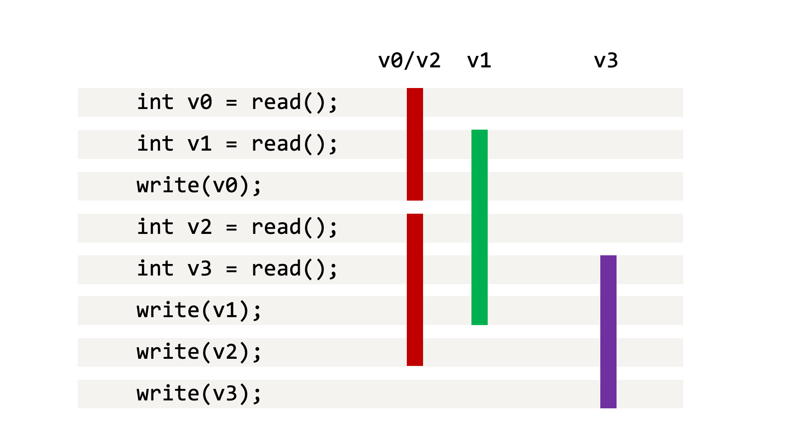
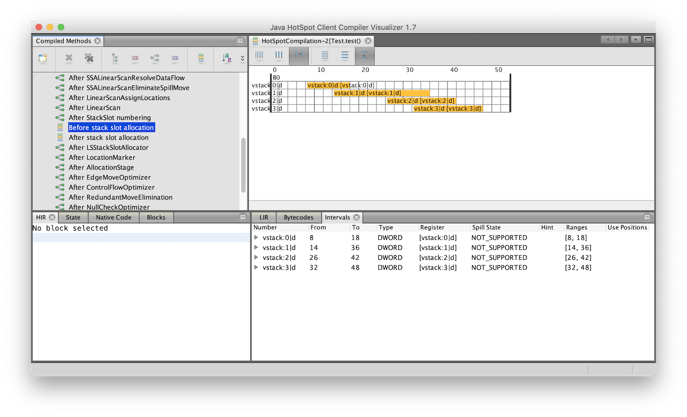
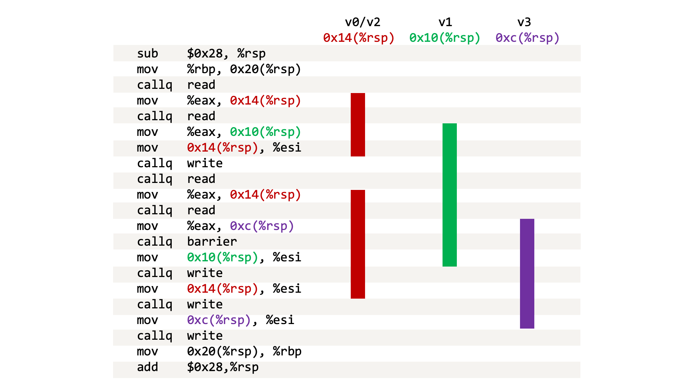

When the Java Virtual Machine compiles your Java code to machine code, it needs to allocate registers and other storage locations for variables. In this short post we're going to show how we can relate the original Java code first to the theory, then to how the compiler sees it, and then to the resulting machine code. What we want to show is that we can easily see the concepts working in practice in a real compiler.

We're going to be showing output of the Graal just-in-time compiler, but the concepts are similar for other Java just-in-time and ahead-of-time compilers, and for compilers for many other languages.

This Java code runs the method `test` in a loop to trigger compilation. There is a `read` method to produce values, a `write` method to consume them, and a `barrier` method that simplifies some things and we'll explain it in the end notes.

```java
class Test {

    public static void main(String[] args) {
        while (true) {
            test();
        }
    }

    private static void test() {
        int v0 = read();
        barrier();
        int v1 = read();
        barrier();
        write(v0);
        barrier();
        int v2 = read();
        barrier();
        int v3 = read();
        barrier();
        write(v1);
        barrier();
        write(v2);
        barrier();
        write(v3);
    }

    private static int read() {
        return 14;
    }

    private static void write(int value) {
    }

    private static void barrier() {
    }

}
```

We're going to look at the register allocation in the `test` method. We've removed the calls to `barrier` between each line for simplicity.

```java
int v0 = read();
int v1 = read();
write(v0);
int v2 = read();
int v3 = read();
write(v1);
write(v2);
write(v3);
```

We can reason about the register allocation for this program just by looking at the Java code. We want to think about how long each variable needs to be stored for. We call this the *live ranges*, or *intervals*. We can do this by drawing a table with each line of code being a line, and having a column for each variable, with a bar showing how long the variable needs to be stored until it can be forgotten.


The key observation here is that we've got four variables that we need to keep alive, but it looks like we can probably fit them into just three storage locations. See how the bars for `v0` and `v2` never overlap. `v0` can be discarded before `v2` is ever created, so we could re-use the storage for `v0` for `v2` later on. We could instead share storage for `v0` and `v3` if we wanted to, but let's use a *first-fit* approach and re-use the first storage location that's available.



A more formal way to look at register allocation is to build a graph where each variable is a node, and there are edges between the graph if they're live at the same time. This is an *interference graph*.


Then we solve the problem of giving each node a color, so that adjacent nodes never have the same color. This is *graph coloring*. We could solve the problem by giving each node a unique color, but we already know this is wasteful.


We can see the two solutions are already came up with.


To now see how Java allocates storage in practice, we can use [GraalVM CE 20.1 Java 8](https://github.com/graalvm/graalvm-ce-builds/releases/tag/vm-20.1.0) to compile the Java code as normal.

```
% ./graalvm-ce-java8-20.1.0/Contents/Home/bin/javac Test.java
```

We can then run it with some flags set to see what it does with the code. We use `-XX:CompileOnly=Test::test` so that the calls to `read`, `write` and `barrier` do not inline. If they did inline it would allow the compiler to significantly restructure the program and would obscure what we're looking for. We use `-Dgraal.Dump=:3` to write out how the compiler understands the program to a file we can inspect later. We use `-XX:+UnlockDiagnosticVMOptions -XX:+PrintAssembly` to print the resulting machine code as assembly. We'll need [`hsdis`](https://lafo.ssw.uni-linz.ac.at/pub/graal-external-deps/hsdis/intel/) in the current directory in order to run this.

```
% ./graalvm-ce-java8-20.1.0/Contents/Home/bin/java -XX:CompileOnly=Test::test -Dgraal.Dump=:3 -XX:+UnlockDiagnosticVMOptions -XX:+PrintAssembly Test
```

Now we're going to use a tool called the [c1visualizer](https://github.com/chrisseaton/c1visualizer/releases/tag/v1.7). This tool allows us to look at the how the compiler understands your program in the back-end, when it's generating code and allocating storage locations to variables.

```
% jdkhome=./graalvm-ce-java8-20.1.0/Contents/Home ./c1visualizer/bin/c1visualizer
```

On the left we can see the program move through various phases of the compilation back-end.



If we look at *Before stack slot allocation*, we can see `v0` to `v3`. In this view, the variables are rows, and the source code is the columns, but it's showing bytecode rather than Java source lines now. We can see the same four intervals we had in the source code.

If we look at *After stack slot allocation*, we can see it's now allocated machine stack locations for these variables. These numbers are the offset from the start of the stack frame. They don't go up by four each time, as they are byte addresses, and we're storing a Java `int` which is four bytes, and they don't start at zero as Java stores some other information on the stack beside our variables.

We also can see it's done what we did with pen and paper - it's stored `v0` and `v2` in the same stack location - they're both in `stack:28`.


Finally, we can look at the disassembled machine code generated by the compiler. We've simplified it slightly for clarity and we're still removing the calls to `barrier`. Each time we call `read` it returns the value in the `%eax` register, so an instruction `%eax,0x14(%rsp)` is for example storing the return value into `0x14(%rsp)`, which is another way to write `%rsp + 0x14`. `%rsp` is the stack pointer, so stack locations are addressed relative to the bottom of the current stack (bottom because it grows downward.)

```s
sub    $0x28,%rsp
mov    %rbp,0x20(%rsp)
callq  read
mov    %eax,0x14(%rsp)
callq  read
mov    %eax,0x10(%rsp)
mov    0x14(%rsp),%esi
callq  write
callq  read
mov    %eax,0x14(%rsp)
callq  read
mov    %eax,0xc(%rsp)
mov    0x10(%rsp),%esi
callq  write
mov    0x14(%rsp),%esi
callq  write
mov    0xc(%rsp),%esi
callq  write
mov    0x20(%rsp),%rbp
add    $0x28,%rsp
```

We can see again, that the first and third calls to `read` - that's `v0` and `v2` - return a value that is stored into the same location - `0x14(%rsp)`. `v1` goes into `0x10(%rsp)` and `v3` into `0xc(%rsp)`. We can draw the same table for this machine code as we did for our Java code.



The point of all this is *all these diagrams match up in practice*! The pencil-and-paper reasoning of the Java code with tables and interference graphs that an undergraduate might do in an exam, matches up with how the production compiler understands it, and matches up with the machine code produced and run. We can see the theory working in practice, pretty directly.

## Notes

We talked about *variables* being allocated to *storage locations*. What we really mean by variable is anything that the compiler may want to store - they may not correspond to any real local variables, and not every local variable is necessarily stored.

We started talking about *register* allocation, but then generalized that to *storage location*, and then the compiler actually used the stack and no registers. The reason for this is that the values are live across calls, and HotSpot's internal calling convention does not have any callee-saved registers - the caller must ensure all values are out of registers and saved on the stack.

The purpose of the `barrier` call is that without it the live ranges shrink somewhat due to them not having to be kept alive for as long, so that they end up not overlapping as we intend. We turned off inlining because without it our `barrier` call would not work as intended.

The actual register allocation algorithm Graal is using is the *linear scan*.

If you noticed that the stack locations show by the c1visualizer don't match the offsets in the machine code, it's because they count in different directions and c1visualizer is also accounting for the return address on the stack. If you noticed that there is apparently empty space in the stack frame, which is due to an extra slot used during deoptimization, and alignment.

## Acknowledgements

Tom Rodriguez helped me answer some questions about the HotSpot calling convention and frame layout.
