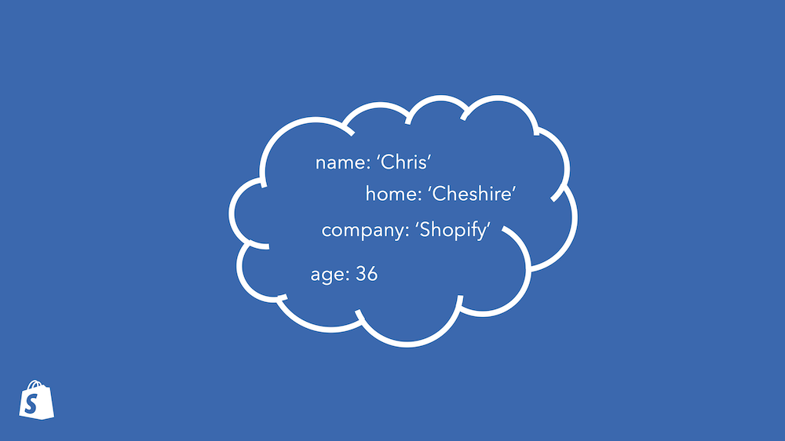
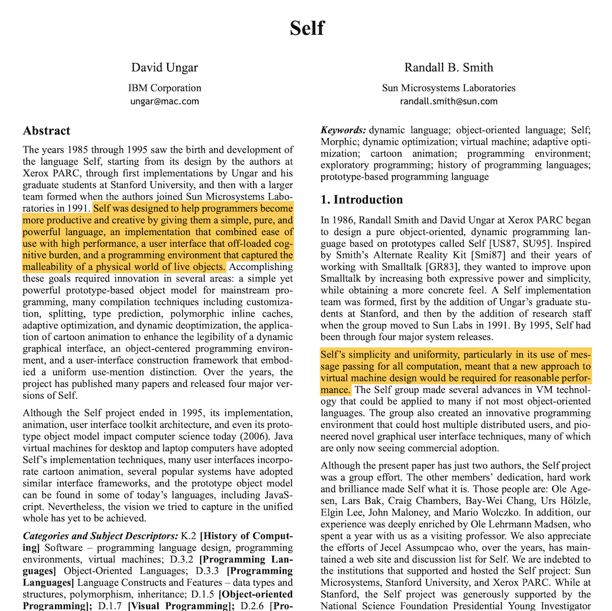
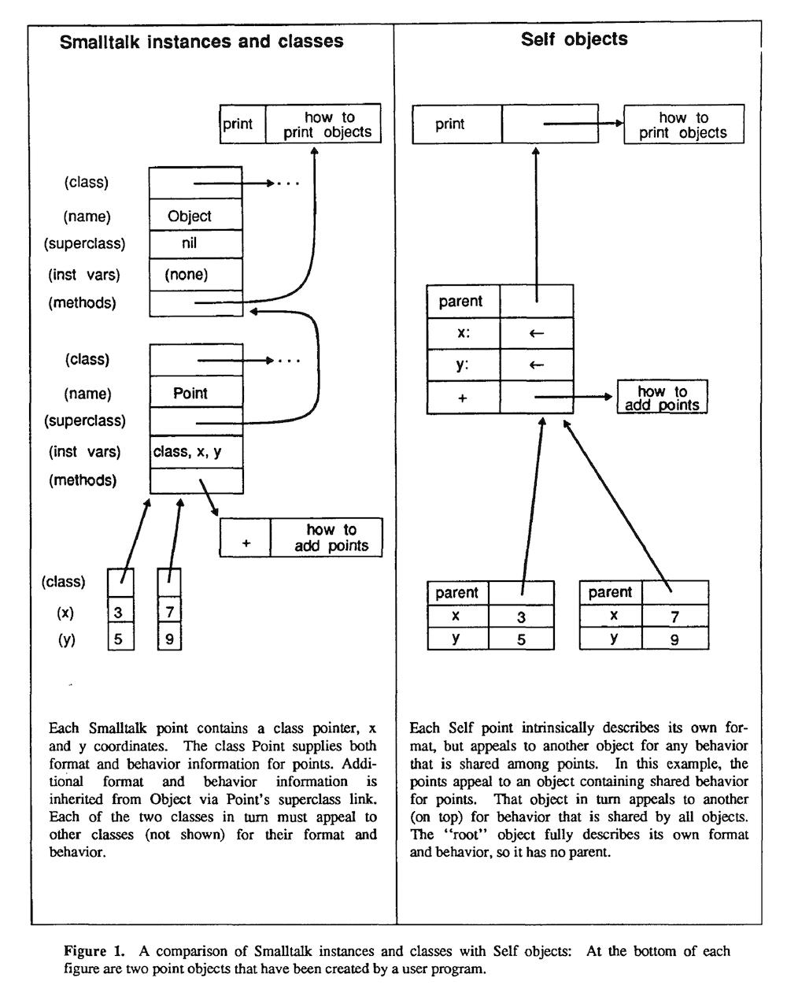
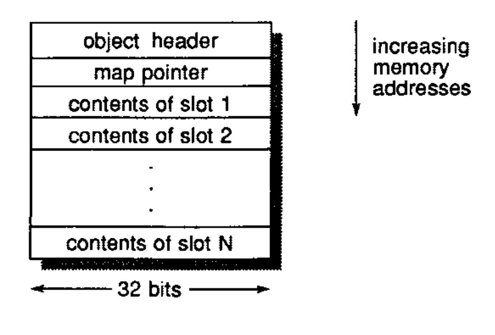
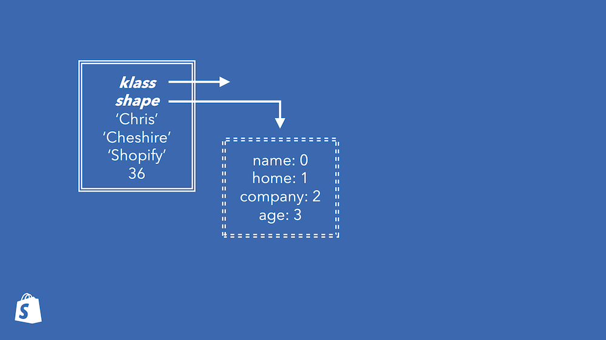
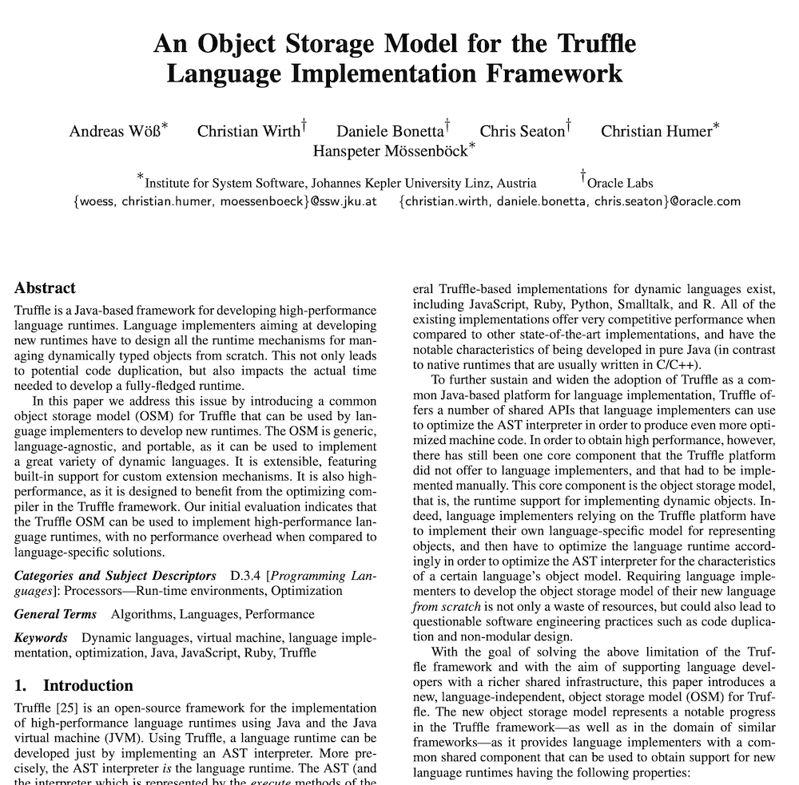
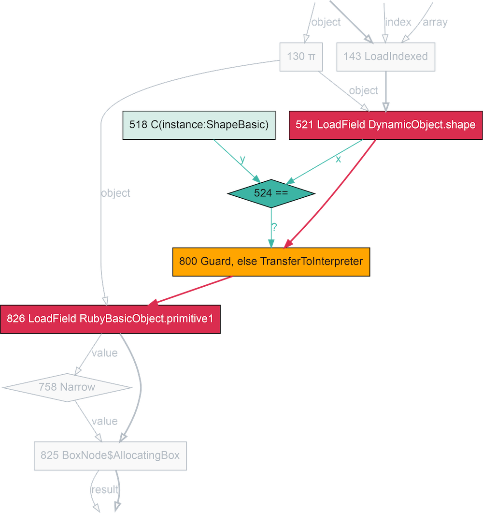
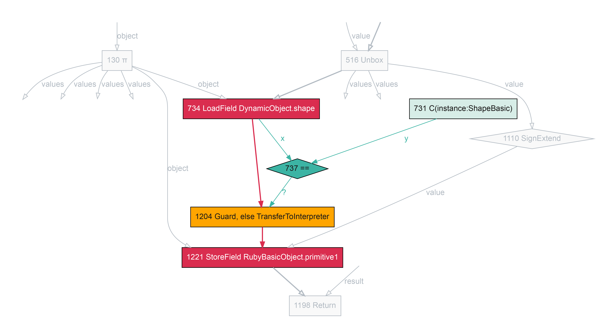
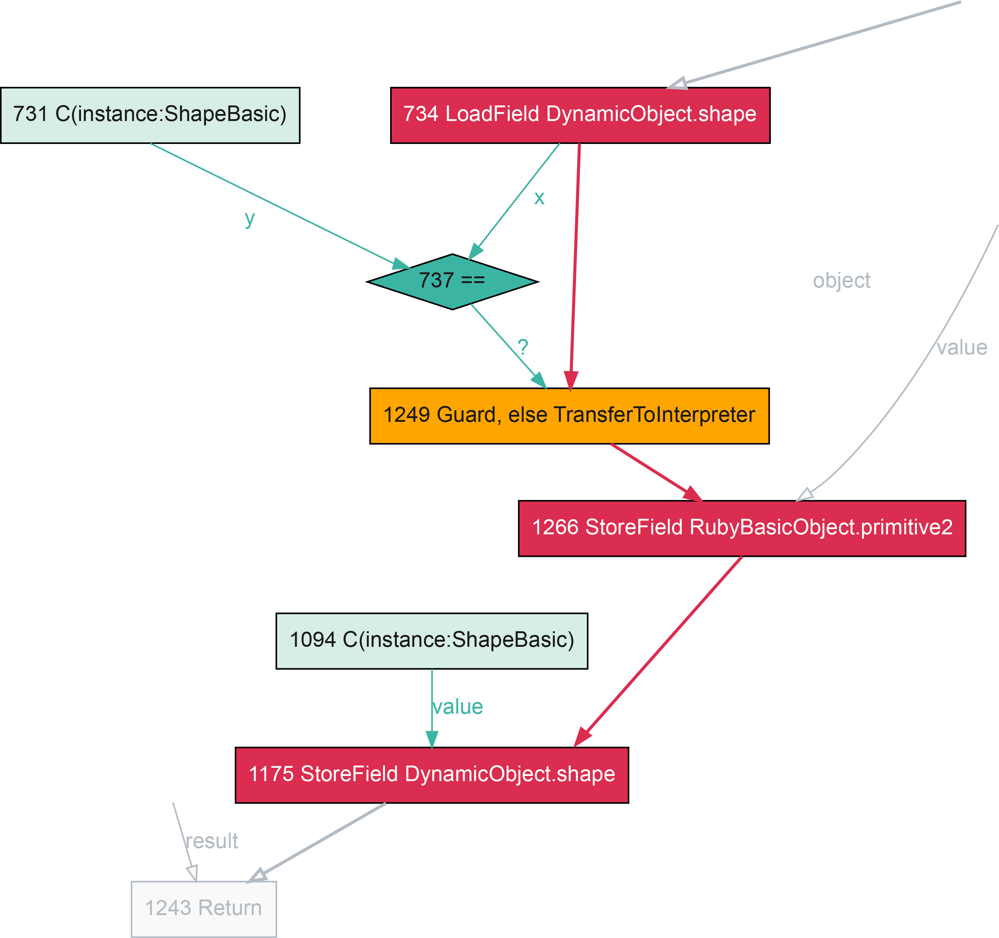
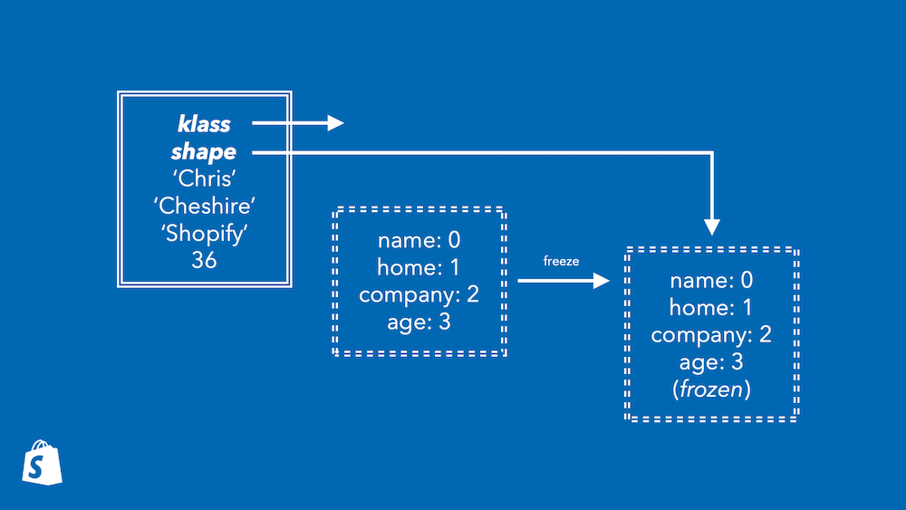

*These are the notes for a talk I gave at RubyKaigi 2021, which is why they're
written as if we were talking and going through some slides and code together.*

<iframe width="720" height="433" src="//www.youtube.com/embed/RqwVEw-Rd5c" frameborder="0" allowfullscreen></iframe>

Hello I'm [Chris Seaton](../../). I'm a Senior Staff Engineer at
[Shopify](https://shopify.engineering) where I'm working on Ruby performance.
I'm the founder of [TruffleRuby](https://www.graalvm.org/ruby/), which is a
very highly optimizing implementation of Ruby. I also maintain [The Ruby
Bibliography at rubybib.org](https://rubybib.org) that documents research on
Ruby.

Today I want to share some existing ideas that TruffleRuby uses for how to
implement objects in Ruby, that we think could be applied in MRI or other
implementations of Ruby. We'll explain where these ideas have come from and
what their history is. We'll describe how they work in a high-level way, and
then we'll show how TruffleRuby implements them and what it's able to achieve,
and how MRI could do the same things.

We'll then look further into the future and talk about what else could be built
on top of these ideas.

## What if?

When people ask me about why Ruby is sometimes slower than other languages, the
headline reason I give them is that it's all about the *what ifs*.

Ruby implementations spend a huge amount of time asking themselves *what if?*
while they run your programs. For every add operation it has to think *what if
it has overflowed?*, for every method call it has to think *what if the method
has been monkey patched*, for every line of code it has to think *what if
someone has enabled tracing?*, and so on.

There's a lot of work at the moment to try to reduce the costs of these *what
ifs*. [MJIT](https://k0kubun.medium.com/ruby-3-0-jit-and-beyond-4d9404ce33c),
[JRuby](https://www.jruby.org), [Sorbet
Compiler](https://sorbet.org/blog/2021/07/30/open-sourcing-sorbet-compiler),
[YJIT](https://github.com/Shopify/yjit), TruffleRuby, and more all work
toward this in some way. But apart from JRuby and TruffleRuby, they all use Ruby
objects in the same way - they aren't yet solving the *what ifs* for Ruby
objects.

And there are a lot of *what ifs* associated with Ruby objects. We constantly
need to ask *what if the object is frozen?*, *what if the object doesn't have
the instance variable I want?*, *what if the object is shared between multiple
Ractors?*. The idea of *object shapes* that we're going to describe is a
technique that tries to remove as many of these *what ifs?* as possible.
Several people think that taking this next step will make other efforts to
improve Ruby performance, such as MJIT, Sorbet Compiler, and YJIT, more effective.

We'll see later on that it may also have some benefits for the space your
Ruby program needs to run, so it's not just all about time performance.

## What is a Ruby object?

When we talk about Ruby objects here, we're talking specifically about objects
with instance variables. And we're talking about how those instance variables
are stored inside the object. There's lots of other interesting aspects of
objects, and we'll talk about some more towards the end of the talk, but for
the big idea here we're talking about instance variables.



For our purposes, a Ruby object is a bag of key-value pairs. Unlike a Ruby
`Hash`, all the keys are symbols, and the key-value pairs aren't ordered in any
way.

We can get and set these instance variables using the `@` syntax, but we can
also use `instance_variable_get` and `_set`, and there are methods such as
`instance_variables` which give you all the keys, and keywords such as
`defined?` which tells you if a key is set or not. A debugger may give you
similar tools to get and set instance variables. Ideally we'd like to consider
all of these syntaxes and methods as being as equally important and worth
optimizing, so that people can use whichever they think is the right tool for
the problem they're solving, without worrying about which is faster.

It's really important to emphasize at this point that in Ruby, instance
variables conceptually live in the object - that is, they aren't part of the
object's class or metaclass. You don't define them in the class - you just go
ahead and use them.

## How do Ruby implementations handle objects?

Let's look at how objects and instance variables work today in a couple of
Ruby implementations.

### MRI

(Note that the code I'm going to show in this talk is significantly simplified
for clarity, and removes a lot of corner cases and optimizations that aren't
relevant for this discussion - such as class instance variables, embedded
instance variables, and generic instance variables.)

*MRI*, or *CRuby*, is the standard implementation of Ruby, implemented in C.
Let's look at MRI's data structures first.

```c
struct RObject {
  VALUE   klass;
  int     numiv;
  VALUE[] ivptr;
};

struct RClass {
  struct st_table *iv_index_tbl; // Hash of Symbol -> index
};
```

In objects we have a reference to the class, a number of instance variables in
the object, and then a reference to an array of values of instance variables.

In classes we have a hash of instance variable names as symbols to their index
in objects.

Now let's look at the code MRI uses to access these data structures. I'm going
to focus exclusively on the *fast path*, or *happy path*, that is taken when
everything is working well, that is encountered most of the time by idiomatic
Ruby code. There's also *slow path*, or *fallback* code, that handles
everything else but we won't go into that there.

We can see that the code checks that the class serial is the same as the
expected class serial that has been recorded on the last access. A class serial
is the version number of a class. It's incremented when the class is modified.
We then also have to check that the object has as many instance variable slots
as required because the object may not be the same size as other instances of
the same class.

```c
VALUE vm_getivar(VALUE obj, IVC inline_cache) {
  if (inline_cache && inline_cache->class_serial == obj->klass->class_serial) {
    int index = inline_cache->index;
    if (obj->type == T_OBJECT) && index < obj->numiv) {
      return obj->ivptr[index];
    } else {
      // slow path
    }
  } else {
    // slow path
  }
}

VALUE vm_setivar(VALUE obj, VALUE val, IVC inline_cache) {
  if (inline_cache && inline_cache->class_serial == obj->klass->class_serial) {
    int index = inline_cache->index;
    if (obj->type == T_OBJECT) && index < obj->numiv) {
      obj->ivptr[index] = val;
    } else {
      // slow path
    }
  } else {
    // slow path
  }
}
```

<!-- I'm not sure why the class serial isn't incremented on variables being
added so that we wouldn't need to check the number of variables -->

We can also think of this in terms of pseudo-Ruby code if that helps us to
understand.

```ruby
def vm_getivar(cache, obj)
  if cache.serial == obj.klass.serial && cache.index < obj.numiv
    obj.ivptr[cache.index]
  else
    # slow path
  end
end

def vm_setivar(cache, obj, val)
  if cache.serial == obj.klass.serial && cache.index < obj.numiv
    obj.ivptr[cache.index] = val
  else
    # slow path
  end
end
```

### JRuby

*JRuby* is Ruby re-implemented in Java. Unlike MRI's various JITs, it also
re-implements how objects work.

JRuby makes a static guess of what instance variables a class is likely to use,
by looking in all methods (including inherited methods) for the variables that
are referenced with the `@` syntax. It then generates a new Java class at
runtime to contain that many Java fields - one per Ruby instance variable.
These generated Java classes are shared between all Ruby classes that contain
the same number of variables.

Each Ruby class then has a map of instance variable names to their Java field
equivalents.

```java
class TwoVariablesObject {
  Object var0;
  Object var1;
}
```

For the code to access these variables efficiently, JRuby uses a mechanism of
the JVM called *invokedynamic* for accessing these variables. We'll just sketch
the effective result using Ruby rather than going into the Java code.

```ruby
def vm_getivar(cache, obj)
  if cache.id == obj.getMetaClass().getRealClass().id
    obj[cache.index]
  else
    # slow path
  end
end
```

A benefit of this approach is that because the number of instance variables is
allocated statically, we only need to check the object's class is as expected -
we save that check that MRI was doing that the object has enough storage space
for the instance variable. The object's class's identifier is compared against
a cached value. Unfortunately this is three hops from the object - we'll have
to hope both the object and its metaclass and its logical class are all in CPU
cache for this to be efficient.

<!-- I think there's actually other guards as part of the invokedynamic
process - a guard that the access is as expected? But so little of this inlines
(due to bug I previously found?) that hard to tell in practice. -->

Another limitation is the static guess it makes. If it guesses wrong, due to
variables or classes being set up by metaprogramming, it falls back to a slower
path for reading and writing instance variables. This is also the way that
Rubinius worked.

There's arguments for and against this trade-off, but we think we can get the
best of both worlds using shapes.

## History of shapes

The history of object shapes goes back to the *Smalltalk* and *Self* programming
languages. You may have heard people mention these two languages a lot when we
talk about language design and history, and shapes are a great example of a
technique that we owe to the researchers working on these languages.

We don't talk about history enough in our field, so let's take the opportunity
to take a look at the original papers for this idea.

The starting point for this was Smalltalk.


Today we think of Smalltalk as a simple elegant language, but at the time some
people argued it was too complicated. As a reaction, a simpler language called
Self was developed that was intended to increase developer expressiveness and
productivity, or maybe what today we'd call developer happiness.



One of the improvements for simplicity they added was prototypes instead of
classes - prototypes as in the way that JavaScript objects work. Ruby does have
classes, but the methods and instance variables in individual instances doesn't
depend just on the class.



Initially Self was a less efficient language - that's a cost for prioritizing
developer happiness. There's possibly a parallel with Ruby here - the language
that prioritizes developer happiness unfortunately pays some cost in
performance. But this motivated researchers to find ways to make Self more
efficient and overcome the costs they introduced with the design they wanted.


This research led to some major developments that continue to be very
influential today - such as *polymorphic inline caching*. I won't explain this
technique here, but it's key to the high performance that Java and JavaScript
have today. TruffleRuby uses a novel form of polymorphic inline caching called
*dispatch chains* to optimise Ruby's metaprogramming.

The major development we're interested in is *shapes* - or as they're called in
Self, *maps*, or sometimes today in the context of JavaScript they're called
*hidden classes* (we use the term *shape* because *map* could be confused with
hashes.)



Their idea was to separate the keys and the values of instance variables. The
keys would go in a *map*, which would give you the index of the values in the
object. The object referred to the map, so you could use that to find which
value to read for a given variable.

Note that part of the original motivation of this idea was actually space, not
speed, as they now no longer needed to keep a copy of the keys for each object.

## The big idea

That's the history and how the original researchers described it. We'll now try
to give a full explanation of the big idea using terminology and diagrams that
are more concretely relevant to Ruby.



We'll have things that we call the *shapes*. A shape will give a mapping from
instance variable names to their index in all objects with that shape. We'll
draw *shapes* with dashed lines, and objects with full lines. The object
references a class, which isn't important here, and the shape.

Every object has a shape. When an object is given a shape it is also given the
right amount of space that this shape requires. How the space is used is
described by the shape.

To get an instance variable you're conceptually looking up the index in the
shape, and then reading that slot from the object.

```ruby
index = obj.shape[:name]
obj[index]
```

To set an instance variable that has been set before, you're conceptually doing
the same but writing the value.

```ruby
index = obj.shape[:name]
obj[index] = value
```

We'll cover what happens if you set an instance variable that hasn't been set
yet in the object in a minute.

How is this different to what MRI is doing?

Well shapes are immutable. This means that if you knew what the shape was at
any point in the past, you definitely know everything about the shape for the
rest of time. You can hard-code assumptions about it.

And shapes are divorced from classes. Two instances of the same class may have
different shapes. This means that objects don't have to change behind your back
because other instances changed.

All this means you can compare the shape against a shape you expect - probably
a simple word comparison on your processor - and then you know everything you
need to about the object. The shape cannot have changed in the same way that
classes' instance variable tables change in MRI.


If you're setting an instance variable that hasn't been set before, now you're
using something called *transitions*. Shapes also know about what shape you get
when you add, remove, or change instance variables. Here this shape knows
to transition to another shape when a `height` variable is added. We get a
graph of shapes over time describing all the transitions our program makes.

Transitioning an object is not a slow-path operation - it can be done quickly,
using just information from the shape we already have.

```ruby
new_shape = obj.shape.transitions[:add_height]
index = new_shape[:height]
obj.shape = new_shape
obj.resize
obj[index] = value
```

This all comes together for the best effect when you combine it with
compilation to machine code. Machine code can include hard-coded values, so we
can hard-code the address of the object shape to compare against, and we can
hard-code the index to use based on that. Now we can do a machine-word
comparison and a read. If the comparison fails we'll run some other slow-path
code far away. The great news is that these two operations - compare and read -
can run at the same time because your processor can predict that the comparison
will succeed and continue with the read.

```ruby
slow_path unless obj.shape == 0x12345678
obj[4]
```

## How TruffleRuby does shapes

The way that TruffleRuby implements shapes is described in the research paper
*An Object Storage Model for the Truffle Language Implementation Framework* by
Andreas Wöß and others.



We're going to show what TruffleRuby does by showing an internal graph data
structure that it uses to understand and optimize Ruby programs, called the
*intermediate representation*. We're using a tool developed by Shopify called
[Seafoam](https://github.com/Shopify/seafoam) to visualize the graphs.



```ruby
def getter
  @ivar
end
```

In this fragment of a compiler graph, the nodes represent operations, the thick
red lines represent the control-flow, and the thin green lines represent the
data-flow. It's a [flow-chart version of the Ruby code](https://shopify.engineering/understanding-programs-using-graphs), with the implicit parts
of Ruby made explicit.

Here we can see how an instance variable read is done via loading the shape,
comparing it against a known shape, *guarding*, or jumping to a slow-path, if
the comparison fails, and then loading a known location within the object,
`primitive1`.

In the machine code we can see that comparison against the expected shape,
jumping to the slow path they're not the same, and then loading the variable.
Three machine instructions.

```s
0x1242ec600:	cmp	dword ptr [rax*8 + 0xc], expected_shape
0x1242ec60b:	jne	slow_path
0x1242ec611:	mov	r10d, dword ptr [rax*8 + index]
```



In this fragment we can see the code for setting an instance variable which
already exists in the object - so no need to change the shape here. It's the
same as the getter, except the last two operands are the other way around -
writing rather than reading.

```ruby
def setter(value)
  @ivar = value
end
```

```s
0x11fd28a00:	cmp	dword ptr [rsi*8 + 0xc], expected_shape
0x11fd28a0b:	jne	slow_path
0x11fd28a1f:	mov	qword ptr [rsi*8 + 0x20], r10
```



If the instance variable doesn't already exist, we'll be changing the shape,
following the transition from the current shape. As everything in the shape is
hard-coded, so is the transition - we now just write the new shape as well as
writing the new value.

```ruby
class Klass
  def initialize(a)
    @a = a
  end

  def transition(value)
    @b = value
  end
end

loop do
  instance = Klass.new(14)
  instance.transition rand(100)
end
```

```s
0x12b53bb00:	cmp	dword ptr [rax*8 + 0xc], expected_shape
0x12b53bb0b:	jne	slow_path
...
0x12b53bb33:	mov	dword ptr [rax*8 + 0xc], new_shape
...
```

## Typing shapes

Now we can start talking about some more advanced ideas for applying shapes in
Ruby. As well as shapes in TruffleRuby mapping instance variable names to
storage locations, we can also map their types.

In MRI at the moment all instance variables are stored as full `VALUE` objects.
A small integer must be tagged to be stored as an instance variable, and
untagged when it is retrieved. Compilers would like to avoid tagging and
untagging, so if we note in our shape that an instance variable is always an
integer, we know we won't have to tag values going into it, or untag them
coming out again. If the variable becomes something else later on, we'll
transition the shape, just as if we were adding a new variable.

We can see this working in TruffleRuby.

This add routine is in an object where the two instance variables are always
small integers. We can see that the generated machine code reads the values
from the object, having checked the shape, but doesn't do any work to untag or
unbox them - it just uses them. This is because the shape told the compiler
that these variables had the small integer type. When we checked the shape we
also checked the types, and that one check covered both variables at the same
time. We're now getting code that looks more like it [came out of a C
compiler](https://godbolt.org/z/nbTjnqdrz).

```ruby
def add
  @a + @b
end
```

```s
0x12258d380:	cmp	dword ptr [rax*8 + 0xc], expected_shape
0x12258d38b:	jne	slow_path
0x12258d391:	mov	esi, dword ptr [rax*8 + index_a]
0x12258d398:	mov	eax, dword ptr [rax*8 + index_b]
0x12258d39f:	mov	r10d, eax
0x12258d3a2:	add	r10d, esi
0x12258d3a5:	jo	overflow
```

## What else can we use shapes for?



Getting even more inventive, what else could we move into the shape? There are
more properties of objects that are isomorphic to instance variables. For
example the reference to the class, and the frozen state. If we stored these in
the shape, then we'd get two advantages. First, we'd have one less word and one
less bit to store in the object, reducing space. Second, we could collapse
three kinds of check - the class for method calls, the frozen check, and the
instance variable write check, into one - just the shape check.

TruffleRuby already folds the frozen check into the shape. Looking back at our
setter example, we didn't see any code to check if the object was frozen.

```s
0x11fd28a00:	cmp	dword ptr [rsi*8 + 0xc], expected_shape
0x11fd28a0b:	jne	slow_path
0x11fd28a11:	mov	eax, dword ptr [rdx + index]
```

But the check is there - this `expected_shape` is statically known to not be
frozen. If the object was frozen, it would not have this shape - it would have
a different shape, one marked as frozen. This is a great example because it
shows that we can *completely* remove the overhead of a Ruby language feature -
it's the same code as if Ruby didn't have frozen objects!

TruffleRuby doesn't fold the class into the shape at the moment, as the
developers think that conflating the method call class check and the instance
variable check may not be sensible - you'd possibly create polymorphism in
method calls for the unrelated reason that objects have different instance
variables.

TruffleRuby also uses the shape to mark objects as being shared between
threads, and activates locks for synchronization if this is the case. The same
idea could be used for Ractor checks.

## What other ideas are out there for objects?

In general a lot of Ruby optimization effort at the moment is going into
optimizing the execution model of Ruby. MJIT, YJIT, and Sorbet Compiler all
swap out the interpreter for just-in-time compiled machine code, but they leave
the rest of the virtual machine as-is. MJIT and Sorbet Compiler generate what
is effectively a C extension from your code, to plug into standard MRI, and
YJIT is roughly similar.

I would suggest that efforts at optimizing Ruby do need to look at objects some
more. There are exciting ideas that people at Shopify are working on like
concurrent compaction for the garbage collector, variable width allocation of
objects, and novel garbage collectors. TruffleRuby does some incredible
optimizations for hashes and arrays, allowing them to specialize for their size
and what they contain. TruffleRuby also has a very powerful optimization called
[*partial escape
analysis*](https://chrisseaton.com/truffleruby/seeing-escape-analysis/) that
allows objects that are only used within small groups of methods to be
virtualized and never really allocated.

## Practical recommendations

My headline practical recommendation is let's implement object shapes in MRI. I
think the complexity is relatively low, it may even have an immediate speed
benefit for the current MRI interpreter, and it'll certainly help MJIT, YJIT,
and Sorbet Compiler as they continue to develop.

TruffleRuby shows that the idea works well, and there's also some exciting
possibilities for building things beyond that, which we already went through.
The TruffleRuby paper on it that I mentioned talks about more practical
implementation details, and shows the performance it achieves compared to a
couple of other methods.

I don't think there are any major open problem to resolve - I really just think
it needs someone to build it using what we already know, using the chain of
research going back to the early 1980s.

That's all. Thanks very much for listening to my pitch for object shapes in
MRI.

## References

* L. Peter Deutsch and Allan M. Schiffman. 1984. [Efficient implementation of the Smalltalk-80 system](https://dl.acm.org/doi/10.1145/800017.800542). In Proceedings of the 11th ACM SIGACT-SIGPLAN symposium on Principles of programming languages (POPL '84).

* David Ungar and Randall B. Smith. 1987. [Self: The power of simplicity](https://dl.acm.org/doi/10.1145/38765.38828). In Conference proceedings on Object-oriented programming systems, languages and applications (OOPSLA '87).

* Elgin Lee. Object Storage and Inheritance for Self. Engineer's thesis, Electrical Engineering Department, Stanford University, 1988.

* C. Chambers, D. Ungar, and E. Lee. 1989. [An efficient implementation of SELF a dynamically-typed object-oriented language based on prototypes](https://dl.acm.org/doi/10.1145/74877.74884). In Conference proceedings on Object-oriented programming systems, languages and applications (OOPSLA '89).

* Urs Hölzle, Craig Chambers, David Ungar. Optimizing Dynamically-Typed Object-Oriented Languages With Polymorphic Inline Caches. In ECOOP '91.

* David Ungar and Randall B. Smith. 2007. [Self](https://dl.acm.org/doi/10.1145/1238844.1238853). In Proceedings of the third ACM SIGPLAN conference on History of programming languages (HOPL III).

* Andreas Wöß, Christian Wirth, Daniele Bonetta, Chris Seaton, Christian Humer, and Hanspeter Mössenböck. 2014. [An object storage model for the Truffle language implementation framework](https://dl.acm.org/doi/10.1145/2647508.2647517). In Proceedings of the 2014 International Conference on Principles and Practices of Programming on the Java platform: Virtual machines, Languages, and Tools (PPPJ '14).

* Stefan Marr, Chris Seaton, and Stéphane Ducasse. 2015. [Zero-overhead metaprogramming: reflection and metaobject protocols fast and without compromises](https://doi.org/10.1145/2737924.2737963). In Proceedings of the 36th ACM SIGPLAN Conference on Programming Language Design and Implementation (PLDI '15).

* Benoit Daloze, Stefan Marr, Daniele Bonetta, and Hanspeter Mössenböck. 2016. [Efficient and thread-safe objects for dynamically-typed languages](https://dl.acm.org/doi/10.1145/2983990.2984001). In Proceedings of the 2016 ACM SIGPLAN International Conference on Object-Oriented Programming, Systems, Languages, and Applications (OOPSLA 2016).

* Some of the presentation style was inspired by Benoit's [earlier slides on shapes](https://speakerdeck.com/eregon/an-efficient-and-thread-safe-object-representation-for-jruby-plus-truffle).

## Notes

Thank you to [Sam Tam](https://twitter.com/samanthamaytam) for editing my video for me.

* `ruby 3.0.2p107 (2021-07-07 revision 0db68f0233) [x86_64-darwin20]`
* `jruby 9.2.19.0 (2.5.8) 2021-06-15 55810c552b OpenJDK 64-Bit Server VM 11.0.2+9 on 11.0.2+9 +indy +jit [darwin-x86_64]`
* `truffleruby 21.2.0, like ruby 2.7.3, GraalVM CE JVM [x86_64-darwin]`


